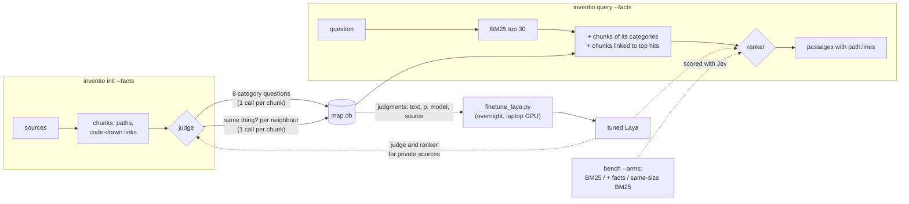

# Inventio

> *Inventio*, from *invenire*: to come upon. The first of the five canons of rhetoric was not
> invention in our sense. The orator did not make his material up; he went looking through
> the *loci*, the places where it already lay, and found it.

That is the rule this tool is built on: the structure of a body of knowledge is found in the
sources (their folders, headings, definitions, the names they share), not made up by a model.

Local retrieval without embeddings. `inventio` indexes your repositories and documents into
one SQLite file, finds candidates with BM25, and lets a decision model reorder the short list:
[Laya](https://github.com/NandhaKishorM/laya) on your own GPU, or
[TypeSafe Jev](https://docs.typesafe.ai) in the cloud for sources you have marked public.
Every answer comes back as the original passage with its coordinates (`path:start-end`), so a
person or an agent can open the exact lines.

There is no vector store and no generation step. The "R" of RAG lives here; the "G" is whoever
calls it.

Laya is the local path and TypeSafe Jev is the model that teaches and tests it. Jev ranks
best, so its numbers are the ceiling a local model is measured against; it judges content
categories and fact links on public sources, and every judgment it makes is kept as training
data for Laya, which then does the same work on sources that must never leave the machine.
See [How Jev is used](#how-jev-is-used).

## Install

```sh
pip install -e .                 # core: standard library only (sqlite3 with FTS5)
pip install -e ".[code]"         # tree-sitter grammars: cut Java, Scala, SQL, TS, Go... at definitions
pip install -e ".[laya]"         # local ranker (torch + transformers)
pip install -e ".[typesafe]"     # cloud ranker; needs TYPESAFE_API_KEY
```

## Use

```sh
inventio init ~/code/fraud-rules --name rules
inventio init ~/notes/wiki --name wiki --public --exclude "drafts/*"
inventio facts --source wiki --judge typesafe   # categories + fact links, judged by Jev (public only)
inventio facts --source rules                   # the same with Laya, on this machine (the default)
inventio sources

inventio query "which job recomputes customer risk overnight?"
inventio query "..." --ranker laya              # local GPU/CPU
inventio query "..." --ranker typesafe --source wiki
inventio query "..." --json                     # for agents
inventio query "..." --ranker typesafe --types  # also search inside the document types it predicts
inventio query "..." --ranker laya --facts     # also add chunks of its categories and linked chunks
```

Results are grouped by document type, groups in the order of their best hit; each result
shows where it lives and where it leads:

```
== Article
1. wiki:runbook.md:1-2  Daily scoring
   The nightly job `fraud_score_daily` recomputes customer risk before the morning review.
   -> mentions rules:jobs/score.py:1-2  (fraud_score_daily)
```

Re-running `init` on a source updates it in place: files whose size and modification time
match the map are skipped without being read, files with the same content hash are only
re-stamped, and only new or edited files are chunked again (deleted ones leave the map). On
astropy (1,260 files, 22,327 chunks) the first index takes 12.8 s and a re-run after editing
one file 1.4 s, most of it rebuilding links across the whole map. `--full` rebuilds from scratch.

The map lives in your user cache (`%LOCALAPPDATA%\inventio\map.db`, or `$XDG_CACHE_HOME`,
or `~/.cache`), never inside an indexed repository. Override it with `--db` or `INVENTIO_DB`.
Set a default ranker with `INVENTIO_RANKER`.

## How the map is built

Everything the source already knows is read by code, not guessed by a model.

1. **Structure.** Markdown is cut at headings (fenced code is respected), Python at top-level
   functions and classes (large classes at their methods). With the `code` extra, tree-sitter
   does the same for JavaScript, TypeScript, Java, Scala, Kotlin, Go, Rust, C/C++, C#, Ruby,
   PHP, Swift, Lua, Bash and SQL (a `CREATE TABLE` or `CREATE VIEW` is one definition, named
   by its table). Anything else, or those languages without the extra, is cut at blank-line
   blocks of about 1,500 characters. The file path and heading path of each chunk are indexed
   next to its text, so BM25 can match on where a passage sits as well as on what it says.
2. **Types.** Every file gets one document type from its path, never from a model:
   `SoftwareSourceCode` and `Article` (schema.org), and `Test` and `Configuration`, this
   tool's own words because schema.org has none. `--types` asks the ranker which types would
   hold the answer and adds BM25's best chunks of each likely type to the pool. It only adds:
   a wrong guess costs extra candidates, never an answer plain BM25 had found.
3. **Links.** Drawn by code, named with schema.org's `CreativeWork` vocabulary:
   - `citation`: a Markdown link to a file or a heading, resolved to the chunk it points at.
   - `mentions`: a chunk names an identifier another chunk defines (a function, class or
     table), or chunks in different files share a rare identifier-shaped token
     (`fraud_score_daily`, `risk.daily.score`, `FRAML-123`). This is the bridge between a
     repository and the prose written about it, and it works across sources.
4. **Ranking.** BM25 (SQLite FTS5, diacritics folded) picks 30 candidates; the ranker asks one
   yes/no question per candidate with explicit criteria ("states the specific answer" versus
   "only on a related topic") and sorts by the probability.
5. **Content categories and fact links** (`init --facts`, or `facts` later). The one step
   where a model, not code, decides what the map says. Every chunk of prose is asked one
   yes/no question per schema.org top-level type (`Event`, `Person`, `Organization`, `Place`,
   `Product`, `Action`, `Intangible`, `CreativeWork`), whose criteria separate "states
   something about a specific X" from "only names an X in passing"; it keeps every type with
   p ≥ 0.5, at most three. Then up to 10 of its BM25 neighbours in other files that share a
   kept type are asked "do these two passages state something about the same specific
   thing?", and the pairs judged true become `about` links. Jev packs the eight type questions
   into one call per chunk and all neighbours into a second one; on 100 SciFact pairs the
   packed call agreed with one-call-per-pair on 97% of decisions (mean |Δp| 0.04,
   [pack-check](benchmarks/results/pack-check.json)). `query --facts` asks the query's own
   categories, then adds BM25's best chunks of those categories and the chunks the top hits
   are linked to. It only adds candidates, never removes one.

## How Jev is used



Jev has three jobs here, and none of them is to serve private data:

- **Tester.** Every change to the pool is measured three ways on the same questions: plain
  BM25, BM25 plus categories and links, and BM25 with a pool as large as the second one. Jev
  ranks all three, because only a good ranker can show whether a better pool pays off; with a
  weak ranker a bigger pool mostly adds noise.
- **Teacher.** Every judgment Jev makes (category, same-thing link, relevance of a passage to
  a query) is stored in the map's `judgments` and `labels` tables with the text it read, the
  model name and the source. `inventio labels` exports them; `benchmarks/finetune_laya.py`
  trains Laya on them.
- **Ceiling.** Jev's score on each benchmark is the mark a tuned Laya is measured against. It
  runs in the cloud, so Inventio lets it see only sources marked `--public`.

Laya does the same two judgments locally (`--judge laya`, the default), and the whole path,
ingest, categories, links, query and ranking, then runs without a network connection:
`python benchmarks/local_proof.py <dir> "<question>"` indexes a directory into a fresh map with
the TypeSafe key removed and counts outgoing connections; on the .omp design docs it counted
none ([local-proof.txt](docs/design/evidence/local-proof.txt)). Out of the box Laya is not yet
usable as a judge there: it called 2,245 of 2,261 neighbour pairs "the same thing". That is
what the teacher is for.

## Benchmarks

### Do categories and fact links beat plain BM25?

nDCG@10 on the same questions, three pools, each ranked by Jev and by zero-shot Laya. On .omp
and SciFact, Jev judged the categories of every prose chunk and every candidate link pair (no
sampling).

| Corpus (questions) | Ranker | BM25, 30 | + categories and links | BM25, same pool size | facts vs same size, paired (95% CI) |
|---|---|---|---|---|---|
| .omp docs (40) | **Jev** | 0.843 | **0.867** | **0.867** | 0 wins, 0 losses |
| SciFact (300) | **Jev** | 0.765 | **0.771** | 0.769 | +0.002 (-0.003, +0.007) |
| StackOverflow QA (1,994) | **Jev** | not finished: TypeSafe credits ran out | | | |
| .omp docs (40) | Laya zero-shot | **0.515** | 0.507 | 0.475 | +0.031 (+0.005, +0.065) |
| SciFact (300) | Laya zero-shot | **0.302** | 0.249 | 0.252 | -0.004 (-0.012, +0.005) |

Answer among the candidates (what no ranker can fix): .omp 38 → 39 → 39 of 40; SciFact
84.9% → **87.6%** → 86.3%. Pools grew from 30 to 49 (.omp) and 47 (SciFact) candidates.

What this says, with Jev as the ranker:

- Categories and links find answers BM25's 30 missed, and more of them than 17 more BM25
  candidates do (SciFact +2.7 points of recall against +1.3).
- The ranked result rises a little over plain BM25 30 (+0.024 on .omp, +0.006 on SciFact; both
  confidence intervals touch zero), and not beyond a plain BM25 pool of the same size (+0.002
  on SciFact, interval across zero). So far the gain is a bigger pool, not a better one: with
  Jev as the ranker, the optimisation does not yet beat plain RAG. `--facts` stays opt-in.
- With zero-shot Laya every bigger pool loses, because it misranks the added candidates. On
  .omp categories and links lose less than the same-size pool (+0.031, CI above zero); a
  likely reason, not isolated, is that they bring in passages about the same thing rather
  than BM25's next-best word matches. The tuned Laya is the next result to measure.

Raw per-question rows: `benchmarks/results/beir-scifact/arms.jsonl` and
[docs/design/evidence/arms-omp-*.json](docs/design/evidence/). StackOverflow QA has
categories for 26,941 of its 27,018 chunks and links for 10,000 of them; the command in
[benchmarks/README.md](benchmarks/README.md#reproduce) resumes from the stored judgments once
credits are added.

### Against published retrievers

nDCG@10 on three public retrieval benchmarks, every query of each test set, run through
Inventio's real ingest and query path. 1.0 means every right answer sits at the top.

| System | Runs on | SWE-bench Lite | SciFact | StackOverflow QA |
|---|---|---|---|---|
| **Inventio + TypeSafe Jev** | CPU + TypeSafe cloud, ~1.2 s/query | **0.696** | **0.765** | 0.791 |
| **Inventio**, no model | CPU, 35-140 ms/query | 0.540 | 0.670 | 0.670 |
| **Inventio + Laya**, before fine-tuning | laptop GPU, 0.6-0.9 s/query | 0.391 | 0.302 | 0.193 |
| E5-Mistral 7B | 7B embedder | – | 0.764 | **0.915** |
| SFR-Embedding-Mistral 7B | 7B embedder | 0.627 | – | – |
| Voyage-Code-2 | Voyage cloud | 0.291 | – | 0.877 |
| Jina-v2-code | 161M embedder | 0.583 | – | – |
| BGE-base | 110M embedder | 0.449 | 0.740 | 0.736 |

- [SWE-bench Lite](https://arxiv.org/abs/2406.14497): a GitHub issue, find the code files its
  fix touches (300 issues). [SciFact](https://arxiv.org/abs/2104.08663): a scientific claim,
  find the abstract that settles it (300). [StackOverflow QA](https://arxiv.org/abs/2407.02883):
  a question, find its top-voted answer, prose and code mixed (1,994).
- Published figures come from CodeRAG-Bench, CoIR and the models' MTEB cards; – means the
  model was not reported on that benchmark.

What the rows say:

- **Inventio alone**, with no model and no embeddings, is ahead of BGE-base and Voyage-Code-2
  on SWE-bench Lite; only the code-trained Jina-v2-code and the 7B model are ahead of it. The
  likely reason, not yet isolated by an ablation: chunks follow functions and carry their file
  path and name. On text it stays below the embedders.
- **With TypeSafe Jev** reordering Inventio's 30 candidates, it has the best score in the
  SWE-bench Lite comparison (the file to fix comes first for 56% of issues, in the top 5 for
  78%), matches a 7B embedder on SciFact, and gains 0.12 on StackOverflow QA but stays under
  the strongest embedders there: the answer is among the 30 candidates for only 80% of those
  questions, so no reordering of them can pass 0.805. The candidate pool is the next limit.
- **Whole repositories.** Indexed with its tests, docs and configs, SWE-bench Lite drops to
  0.511 with TypeSafe, because tests and docs push the fix's files out of the 30 candidates.
  `--types` lifts it to 0.627 (the gold file in the pool for 81% of issues instead of 63%),
  against 0.560 for a plain BM25 pool of the same size. Details in
  [benchmarks/README.md](benchmarks/README.md#widening-the-pool-by-document-type-swe-bench-lite-mixed).
- **Laya** is a small decision model that runs on your own GPU, so private sources never
  leave the machine. Out of the box it ranks worse than no model at all; its author calls it
  "a fast base to specialise". This row is its zero-shot starting point. The next result is
  Laya fine-tuned overnight on Jev's judgments ([below](#fine-tuning-laya-from-jev)), measured
  on the same test queries, which its training data leaves out.
- To read the comparison fairly: the published figures are single-stage embedders over the
  whole corpus, while Inventio + TypeSafe is two-stage. The two-stage figure in the BEIR paper,
  a cross-encoder reranking the top 100, is 0.688 on SciFact.

Every published model with its source, the whole-repository variant of SWE-bench, caveats and
one-command reproduction: [benchmarks/README.md](benchmarks/README.md).

## Measured on an own corpus

40 questions over 2,132 chunks of Markdown (126 files: design maps, agent skills, logs, in
Vietnamese and English). Each question was written by a small LLM from one passage, picked at
random from 40 different files; the answer is that passage. Questions and raw results:
[docs/design/evidence/](docs/design/evidence/). The bench file format is below.

| Configuration | answer in top 1 | top 5 | top 10 | time per query |
|---|---|---|---|---|
| BM25 on text only | 23/40 | 30/40 | 32/40 | 5 ms |
| BM25 + file and heading path (default) | 24/40 | 32/40 | 35/40 | 5 ms |
| + Laya multilingual, zero-shot | 12/40 | 28/40 | 30/40 | 0.6 s (RTX 5070 laptop) |
| + TypeSafe Jev | **32/40** | **36/40** | **37/40** | 1.1 s |
| + TypeSafe Jev + link expansion | 30/40 | 36/40 | 37/40 | 1.1 s |

What this does and does not say:

- BM25 put the answer among its 30 candidates for 38 of 40 questions. That is the ceiling for
  every ranker; the two misses need a different wording or a path BM25 does not see.
- Zero-shot Laya orders the short list worse than BM25 alone. Its author describes it as "a
  fast base to specialise, not a zero-shot decision engine", and this agrees. It needs
  fine-tuning (below) before it earns its place.
- Widening the candidate pool through links did not bring in a single missing answer here and
  cost two top-1 hits, so it is off by default (`--links` turns it on). Links still appear in
  every result, for navigation. A corpus where code and prose name the same identifiers, such
  as a repository next to its wiki, is where this should be measured again.
- The questions were generated from the answer passages, which favours word overlap; 40 is a
  small sample. Treat these as directions, not as a benchmark.

Reproduce with your own questions:

```sh
inventio bench my-questions.jsonl --ranker none
inventio bench my-questions.jsonl --ranker typesafe --links --json
```

One question per line; a result counts when it overlaps the lines you name:

```json
{"question": "which job recomputes customer risk overnight?", "source": "wiki", "path": "runbook.md", "start_line": 1, "end_line": 2}
```

## Privacy

- Every source is private unless you pass `--public` to `init`.
- `--ranker typesafe` refuses (exit code 3) when any candidate comes from a private source, and
  sends nothing. With `--types` it refuses when any source in scope is private, because the
  widened pool can reach any of them. Narrow the query with `--source`, or rank locally with
  `--ranker laya`.
- `--facts --judge typesafe` (at `init` or `facts`) refuses the same way for a private source
  and judges nothing. At query time it sends only the query text, to predict its categories.
- The map file contains source text. It is ignored by this repository's `.gitignore` and is
  written outside the indexed trees; keep it that way.

## Fine-tuning Laya from Jev

Jev is the teacher and Laya the student. Jev judges well but runs in the cloud, so it may only
see public sources; Laya runs on your machine but has to learn the judgement first. Every Jev
judgment is stored in the map; `inventio labels jev-labels.jsonl` exports them. The overnight
run reads them straight from the maps:

```sh
python benchmarks/finetune_laya.py --time-steps 60   # measure 60 batches, print the projected run time
python benchmarks/finetune_laya.py                   # the overnight run
set INVENTIO_LAYA_MODEL=%LOCALAPPDATA%\inventio\laya-tuned   # Inventio then loads the tuned Laya
```

- **Data.** 464,057 Jev judgments across the .omp map and the SciFact and StackOverflow QA
  maps: categories of chunks and of queries, same-thing links, and relevance of passages to
  SciFact training queries (`beir_bench.py scifact --teach`, stopped at 250 of 809 queries
  when credits ran out). Each becomes one item in the form Laya reads at inference, with Jev's
  p as a soft target; 60,000 are drawn, balanced by kind and answer.
- **Kept out.** Every test query of the three benchmarks and every chunk that answers one
  (46,975 judgments dropped), plus a fixed 10% of all other chunks, written to `holdout.jsonl`
  so the tuned Laya can be scored against Jev on judgments it never saw.
- **Run time on this laptop** (RTX 5070 Laptop, 8 GB): 0.33 to 0.44 s per batch of 8, so
  1.4 to 1.8 hours for 2 epochs, peak 4.4 GB of GPU memory. The loop is the one in the Laya
  author's fine-tuning notebook, ported to one GPU with the token embeddings frozen.

## Not yet

- Connectors beyond the local file system (Confluence, Slack, mail).
- The benchmark of the tuned Laya, and the StackOverflow QA arms with Jev (both need the runs
  above to finish).

## License

Apache-2.0.
