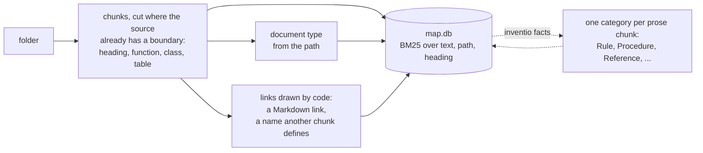
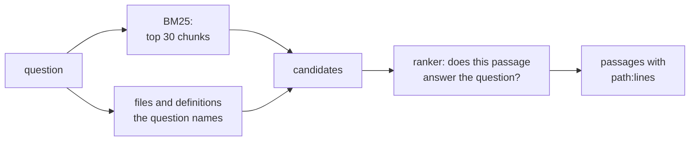

# Inventio

> *Inventio*, from *invenire*: to come upon. In classical rhetoric the orator did not make his
> material up; he went looking through the *loci*, the places where it already lay.

Inventio finds the passage that answers a question in your code and documents, and tells you
where it lives (`path:start-end`), so a person or an agent can open the exact lines. It is the
"R" of RAG; the "G" is whoever calls it.

It uses no embeddings. The structure comes from the sources themselves (folders, headings,
function and table definitions, the names files share), BM25 finds candidates, and a small
decision model reorders them: [dispositio](https://huggingface.co/minhquan2310/dispositio) on
your own machine, or [TypeSafe Jev](https://docs.typesafe.ai) in the cloud for sources you mark
public. Everything lives in one SQLite file.

## Quick start

```sh
pip install -e ".[code,laya]"
inventio init ~/code/fraud-rules --name rules
inventio init ~/notes/wiki --name wiki
inventio query "which job recomputes customer risk overnight?"   # ranked by dispositio
```

```
== Article
1. wiki:runbook.md:1-2  Daily scoring
   The nightly job `fraud_score_daily` recomputes customer risk before the morning review.
   -> mentions rules:jobs/score.py:1-2  (fraud_score_daily)
```

`--json` gives the same for agents. The map lives in your user cache (`%LOCALAPPDATA%\inventio`,
`$XDG_CACHE_HOME` or `~/.cache`), never inside an indexed repository.

## How it works

### Ingest



Nothing above the dotted line is guessed by a model. A re-run reads only the files that changed:
astropy (22,327 chunks) indexes in 12.8 s, and again after one edit in 1.4 s.

### Query



Looking up the names a question contains needs no model, so it is on by default. Four opt-in
flags add candidates before ranking and never remove one: `--types` (the document types the
question asks for), `--facts` (its categories, and linked chunks), `--neighbours` (chunks of
other files sharing the top hits' rarest words), `--links` (what the top hits cite or mention).
A Vietnamese question is also searched as pairs of adjacent syllables, since *hợp đồng*
(contract) is two words to BM25.

## What the map holds

- **Chunks** with their file path and heading path indexed next to the text, so BM25 matches
  where a passage sits as well as what it says.
- **Document types** from the path: `SoftwareSourceCode`, `Test`, `Configuration`, `Article`.
- **Links drawn by code.** `citation`: a Markdown link, resolved to the chunk it points at.
  `mentions`: a chunk names what another defines, or two files share a rare identifier
  (`fraud_score_daily`, `FRAML-123`). This connects code to the prose written about it.
- **Categories** (after `inventio facts`): what a prose chunk does for its reader.

  | Category | The passage | A question it answers |
  |---|---|---|
  | Rule | states what must, may or must not be done | "is it allowed to...", "what is the limit" |
  | Procedure | walks through how to do something | "how do I..." |
  | Reference | describes what something is or contains, for lookup | "what are the fields of..." |
  | Explanation | explains why or how something works | "why does..." |
  | Finding | reports what was measured or observed | "does it work", "how much faster" |
  | Record | tells what happened or was decided | "when did this change", "what broke last time" |
  | Other | none of these: a table of contents, credits, boilerplate | |

  Categories cut a corpus into regions instead of all covering it, so `--facts` widens toward
  the kind of passage the question wants. `about` links join passages of different categories
  that state something about the same thing: the rule, the runbook that carries it out, the
  incident that broke it.
- **Judgments.** Every model decision is stored with the text it read, so a rebuilt map pays
  nothing twice.

## dispositio

[dispositio](https://huggingface.co/minhquan2310/dispositio), the second canon of rhetoric
after *inventio*, is [Laya](https://github.com/NandhaKishorM/laya) (mmBERT-base, 322M) fine-tuned
for the two questions Inventio asks: does this passage answer the query, and what does this
passage do for its reader. It runs on a laptop GPU or a CPU and nothing leaves the machine.

```sh
inventio query "..."                      # dispositio ranks by default, downloaded once from Hugging Face
inventio facts --source wiki              # categories, judged by dispositio
```

`--ranker laya` is Laya as published, `--ranker none` BM25 order. `INVENTIO_DISPOSITIO_MODEL`
points `dispositio` at another checkpoint: a directory or a Hugging Face id, such as a fine-tune
of your own.

Relevance labels are written by people: the train splits of SciFact, StackOverflow QA and Zalo
legal, and 3,923 SWE-bench train issues paired with the code their fix changed (35 repositories,
none of them in SWE-bench Lite). Category labels, for which no human set exists, are a small
general model's. `benchmarks/finetune_laya.py` reproduces it in 24 minutes on an RTX 5070 laptop
GPU; results, training data and terms are on the model card.

## Benchmarks

nDCG@10 on every test query, through Inventio's real ingest and query path; the rankers reorder
the same 30 BM25 candidates. Method and reproduction: [benchmarks/README.md](benchmarks/README.md).

| System | Runs on | SWE-bench Lite | SciFact | StackOverflow QA | Zalo legal |
|---|---|---|---|---|---|
| **Inventio + Jev** | TypeSafe cloud, ~1.2 s/query | **0.696** | **0.765** | 0.791 | not run |
| **Inventio + dispositio** | laptop GPU, 0.4-0.9 s/query | 0.655 | 0.722 | 0.699 | **0.831** |
| **Inventio**, no model | CPU, 35-140 ms/query | 0.540 | 0.670 | 0.670 | 0.756 |
| **Inventio + Laya**, not tuned | laptop GPU, 0.6-0.9 s/query | 0.391 | 0.302 | 0.193 | 0.512 |
| E5-Mistral 7B | 7B embedder | – | 0.764 | **0.915** | – |
| SFR-Embedding-Mistral 7B | 7B embedder | 0.627 | – | – | – |
| Voyage-Code-2 | Voyage cloud | 0.291 | – | 0.877 | – |
| Jina-v2-code | 161M embedder | 0.583 | – | – | – |
| BGE-base | 110M embedder | 0.449 | 0.740 | 0.736 | – |

SWE-bench Lite: a GitHub issue, find the code files its fix touches (300 issues). SciFact: a
claim, find the abstract that settles it (300). StackOverflow QA: a question, find its accepted
answer (1,994). Zalo: a Vietnamese question, find the law article (788). Published figures come
from CodeRAG-Bench, CoIR and the models' MTEB cards; they are single-stage embedders over the
whole corpus, while Inventio with a ranker is two-stage.

- **No model**: ahead of BGE-base and Voyage-Code-2 on SWE-bench Lite. The likely reason, not
  isolated by an ablation, is that chunks follow functions and carry their file path. On plain
  text it stays below the embedders.
- **dispositio**, on a laptop: ahead of BM25 on every set, every 95% interval above zero
  (SWE-bench Lite +0.114, Zalo +0.075, SciFact +0.052, StackOverflow QA +0.029), and ahead of
  every embedder listed on SWE-bench Lite, whose 12 repositories it never trained on. Jev stays
  0.04-0.09 ahead on the English sets.
- **Laya as published** ranks worse than BM25 alone, which is why dispositio exists.
- **Whole repositories** (code, tests, docs and configs indexed together) are harder: BM25 0.400,
  dispositio 0.493, Jev 0.515, the two rankers within the noise of each other. Tests and docs
  crowd the files to fix out of the 30 candidates; looking up the names the issue contains puts
  the file among them for 73% of issues instead of 63%.

## Privacy

- Every source is private unless `init` gets `--public`.
- Jev refuses (exit code 3) and sends nothing when any candidate comes from a private source;
  `facts --judge typesafe` refuses a private source the same way.
- With dispositio as ranker and judge the whole path runs offline;
  `python benchmarks/local_proof.py <dir> "<question>"` fails if any connection is attempted.
- The map holds source text. Keep it out of indexed trees and version control.

## Limitations

- Only the local file system is indexed; no connectors for Confluence, Slack or mail yet.
- dispositio has learned science, programming, Vietnamese law and GitHub issues. How well it
  carries to a team's own documents has not been measured.
- `about` links need a judge of "are these two passages about the same thing". dispositio was
  not trained for it, and Laya as published calls nearly every pair the same; use Jev for links.
- The categories above are new. Whether `--facts` with them finds answers a same-size BM25 pool
  does not is not measured yet; the earlier measurement, with schema.org types, is in
  [benchmarks/README.md](benchmarks/README.md#categories-and-fact-links---arms).

## License

Apache-2.0. dispositio's weights carry its training data's terms; see its model card.
