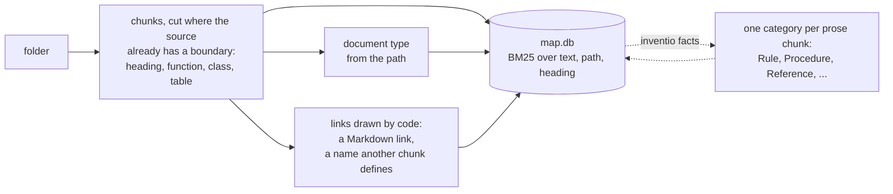
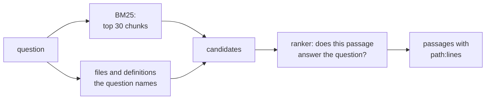

# Inventio

> *Inventio*, from *invenire*: to come upon. In classical rhetoric the orator did not make his
> material up; he went looking through the *loci*, the places where it already lay.

Inventio finds the passage that answers a question in your code, documents, Confluence pages
and Jira tickets, and tells you where it lives (`path:start-end`), so a person or an agent can
open the exact lines. It is the "R" of RAG; the "G" is whoever calls it.

It uses no embeddings. The structure comes from the sources themselves (folders, headings,
function and table definitions, the names files share), BM25 finds candidates, and a small
decision model reorders them: [dispositio](https://huggingface.co/minhquan2310/dispositio) on
your own machine, or [TypeSafe Jev](https://docs.typesafe.ai) in the cloud for sources you mark
public. Everything lives in one SQLite file.

## Quick start

```sh
uv tool install "inventio[laya] @ git+https://github.com/minhquan23102000/inventio"

inventio init ~/code/webshop --name app                            # a folder
export ATLASSIAN_EMAIL=you@example.com ATLASSIAN_API_TOKEN=...       # your own token: you index what you may read
inventio init https://<site>.atlassian.net/wiki/spaces/OPS            # a Confluence space -> wiki-OPS
inventio init https://<site>.atlassian.net/browse/SHOP --jql "updated >= -365d"   # Jira -> jira-SHOP

inventio query "the nightly backup has not finished, what do I do?"   # ranked by dispositio
```

```
== Article
1. wiki-OPS:Nightly-backup-runbook.md:8-13  Nightly backup runbook > When the nightly backup has not finished  p=0.91
   1. Check the scheduler at 07:00. If `nightly_backup` is still running or has failed, stop it. 2. Take a...
   https://<site>.atlassian.net/wiki/spaces/OPS/pages/1234/Nightly+backup+runbook#When-the-nightly-backup-has-not-finished
   -> mentions app:app/jobs/backup.py:4-9  (nightly_backup)
   <- mentions jira-SHOP:SHOP/SHOP-812.md:1-9  (nightly_backup)
```

Then open what a result points at, by coordinate or by the URL someone pasted in chat; look
further when a ranked few is not enough; keep the map current:

```sh
inventio read app:app/jobs/backup.py:4-9          # the lines
inventio read https://<site>.atlassian.net/browse/SHOP-812
inventio show app:app/jobs/backup.py:4-9          # what the map knows: type, category, links, sections around
inventio grep "nightly_backup"                    # every line that says it: code, pages, tickets
inventio ls wiki-OPS:Operations/                  # browse a source like a folder; a file lists its sections
inventio sync                                     # folders re-read, pages and tickets: only what changed
```

`query` is for a question, `show` for where a result leads, `grep` for an exact name (every
caller, every page citing a ticket), `ls` for seeing what is there. Each prints coordinates that
`read` and `show` open; `inventio -h` shows the same walk. `show` labels every fact with what
decided it: the path or a link (code), or a model with its probability (category, `about`).

Without `[laya]` it installs in seconds and ranks by BM25 alone; `[laya]` adds dispositio (and
PyTorch, CPU build unless you install a CUDA one). `uv tool install` puts `inventio` on your PATH
for every terminal; `uvx --from "inventio[laya] @ git+https://github.com/minhquan23102000/inventio" inventio ...`
runs it once without installing.

`--json` gives the same for agents. All sources share one map, so a query and the links reach
across them (the job in `app`, the runbook in `wiki-OPS`, the incident ticket in `jira-SHOP`);
`--source` narrows a query to some of them, and `--db` or `INVENTIO_DB` keeps a separate map.
It lives in your user data directory (`%LOCALAPPDATA%\inventio`,
`~/Library/Application Support/inventio`, or `~/.local/share/inventio`), never inside an
indexed repository.

## How it works

### Ingest



Nothing above the dotted line is guessed by a model. A re-run reads only the files that changed:
astropy (22,327 chunks) indexes in 12.8 s, and again after one edit in 1.4 s.

### Query



Looking up the names a question contains needs no model, so it is on by default. Four opt-in
flags add candidates before ranking and never remove one: `--types` (the document types the
question asks for), `--facts` (its categories, and linked chunks), `--neighbours` (chunks of
other files sharing the top hits' rarest words), `--links` (what the top hits cite or mention).
A Vietnamese question is also searched as pairs of adjacent syllables, since *hợp đồng*
(contract) is two words to BM25.

## What the map holds

- **Chunks** with their file path and heading path indexed next to the text, so BM25 matches
  where a passage sits as well as what it says.
- **Document types** from the path: `SoftwareSourceCode`, `Test`, `Configuration`, `Article`,
  and `Dataset` for the card of a table, topic or data file (see [Where the data lives](#where-the-data-lives)).
- **Links drawn by code.** `citation`: a Markdown link, resolved to the chunk it points at.
  `mentions`: a chunk names what another defines, or two files share a rare identifier
  (`nightly_backup`, `SHOP-812`). This connects code to the prose written about it.
- **Categories** (after `inventio facts`): what a prose chunk does for its reader.

  | Category | The passage | A question it answers |
  |---|---|---|
  | Rule | states what must, may or must not be done | "is it allowed to...", "what is the limit" |
  | Procedure | walks through how to do something | "how do I..." |
  | Reference | describes what something is or contains, for lookup | "what are the fields of..." |
  | Explanation | explains why or how something works | "why does..." |
  | Finding | reports what was measured or observed | "does it work", "how much faster" |
  | Record | tells what happened or was decided | "when did this change", "what broke last time" |
  | Other | none of these: a table of contents, credits, boilerplate | |

  Categories cut a corpus into regions instead of all covering it, so `--facts` widens toward
  the kind of passage the question wants. `about` links join passages of different categories
  that state something about the same thing: the rule, the runbook that carries it out, the
  incident that broke it.
- **Judgments.** Every model decision is stored with the text it read, so a rebuilt map pays
  nothing twice.

## Confluence and Jira

Token and commands: [Quick start](#quick-start).

A remote source is mirrored as Markdown under the data directory, one file per page or ticket,
and indexed like a folder: the same chunks, links and judgments.

- **Pages** keep the page tree as folders. Links between pages of the space become `citation`
  links; `include` becomes a link to the page it pulls from; code stays code; tables stay
  tables, long ones repeating their header. Images and embedded diagrams (Lucidchart, Figma,
  draw.io) are not read but keep their place as ``.
- **Tickets** are records: summary, status and people, links to other tickets, the
  description, then every comment under its own heading. A file named after its key defines
  it, so a page or a line of code that says `SHOP-812` links to the ticket.
- **Sync** lists each item's version (page version, ticket update time) without its body,
  fetches only what changed, moves renamed pages and deletes what is gone.
- **Results** carry the web address of their heading or comment beside the coordinate.
  `inventio read` takes either: a coordinate, or a page or ticket URL, read from the mirror
  when it is there and fetched live (not added to the map) when it is not. `inventio show`
  follows the links, so an agent can walk from a rule to its code to its incident.

Connectors live in `inventio/connectors/`: one module per kind lists items with a version and
turns one item into Markdown; mirroring, indexing and `read` are shared, so mail or chat is
one more module.

## Where the data lives

```sh
pip install "inventio[data]" psycopg2-binary       # DuckDB, SQLAlchemy, Kafka, boto3; plus your database's driver
inventio init postgresql://reader@db.internal/core  # password from PGPASSWORD or INVENTIO_SQL_PASSWORD
inventio init "kafka://broker:9092?registry=http://registry:8081"
inventio init s3://lake/warehouse/                  # AWS_* variables; AWS_ENDPOINT_URL for MinIO and the like
```

A runbook says "the job copies the orders database" without saying where. Each table, view, Kafka
topic, S3 dataset and local data file (`.parquet`, `.csv`, `.tsv`, `.jsonl`) becomes one
Markdown card: where to connect, the columns with their types and comments, keys and indexes,
a view's definition, a topic's partitions, retention and value schema. Only the catalog is read,
never a row; a topic without a registered schema has one message read for its field names and
types, and its values are not kept. A database password is never written to the map.

A card defines its table's name, so code, SQL, dbt models, runbooks and tickets that say
`shop.orders` link to it, and a foreign key is a link from one card to the other.
Cards are `Dataset` documents filed under `Reference` by code, never sent to a model. BM25
finds a card by its name and its column comments; a card without comments is best reached
through `inventio show` from the code or runbook that names it. S3 folders like `dt=2026-09-24/`
are partitions of one dataset, not datasets of their own.

## dispositio

[dispositio](https://huggingface.co/minhquan2310/dispositio), the second canon of rhetoric
after *inventio*, is [Laya](https://github.com/NandhaKishorM/laya) (mmBERT-base, 322M) fine-tuned
for the two questions Inventio asks: does this passage answer the query, and what does this
passage do for its reader. It runs on a laptop GPU or a CPU and nothing leaves the machine.

```sh
inventio query "..."                      # dispositio ranks by default, downloaded once from Hugging Face
inventio facts --source wiki              # categories, judged by dispositio
```

`--ranker laya` is Laya as published, `--ranker none` BM25 order. `INVENTIO_DISPOSITIO_MODEL`
points `dispositio` at another checkpoint: a directory or a Hugging Face id, such as a fine-tune
of your own.

Relevance labels are written by people: the train splits of MultiDoc2Dial (questions about the
pages of US public services: rules, eligibility, procedures), StackOverflow QA, SciFact and Zalo
legal, and 3,923 SWE-bench train issues paired with the code their fix changed (35 repositories,
none of them in SWE-bench Lite). Category labels, for which no human set exists, are a small
general model's. `benchmarks/finetune_laya.py` reproduces it in two stages, about an hour on an
RTX 5070 laptop GPU; results, training data and terms are on the model card.

## Benchmarks

nDCG@10 on every test query, through Inventio's real ingest and query path; the rankers reorder
the same 30 BM25 candidates. Method and reproduction: [benchmarks/README.md](benchmarks/README.md).

| System | Runs on | SWE-bench Lite | SciFact | StackOverflow QA | Zalo legal | MultiDoc2Dial | TechQA |
|---|---|---|---|---|---|---|---|
| **Inventio + Jev** | TypeSafe cloud, ~1.2 s/query | **0.696** | **0.765** | 0.791 | not run | 0.486 | **0.655** |
| **Inventio + dispositio** | laptop GPU, 0.4-0.9 s/query | 0.661 | 0.728 | 0.590 | **0.830** | **0.643** | 0.444 |
| **Inventio**, no model | CPU, 35-140 ms/query | 0.540 | 0.670 | 0.670 | 0.756 | 0.470 | 0.370 |
| **Inventio + Laya**, not tuned | laptop GPU, 0.6-0.9 s/query | 0.391 | 0.302 | 0.193 | 0.512 | 0.389 | 0.171 |
| E5-Mistral 7B | 7B embedder | – | 0.764 | **0.915** | – | – | – |
| SFR-Embedding-Mistral 7B | 7B embedder | 0.627 | – | – | – | – | – |
| Voyage-Code-2 | Voyage cloud | 0.291 | – | 0.877 | – | – | – |
| Jina-v2-code | 161M embedder | 0.583 | – | – | – | – | – |
| BGE-base | 110M embedder | 0.449 | 0.740 | 0.736 | – | – | – |

SWE-bench Lite: a GitHub issue, find the code files its fix touches (300 issues). SciFact: a
claim, find the abstract that settles it (300). StackOverflow QA: a question, find its accepted
answer (1,994). Zalo: a Vietnamese question, find the law article (788). MultiDoc2Dial: a
question about a US public-service page, find the section that answers (615). TechQA: a question
from IBM's support forums, find the passage of the technote that answers (119). Published
figures come from CodeRAG-Bench, CoIR and the models' MTEB cards; they are single-stage
embedders over the whole corpus, while Inventio with a ranker is two-stage.

- **No model**: ahead of BGE-base and Voyage-Code-2 on SWE-bench Lite. The likely reason, not
  isolated by an ablation, is that chunks follow functions and carry their file path. On plain
  text it stays below the embedders.
- **dispositio**, on a laptop: ahead of BM25 with the 95% interval above zero on SWE-bench Lite
  (+0.121), MultiDoc2Dial (+0.172), Zalo (+0.074), TechQA (+0.074) and SciFact (+0.058), and
  ahead of every embedder listed on SWE-bench Lite, whose 12 repositories it never trained on.
  On the student aid pages of MultiDoc2Dial, held out of training whole, it gains +0.143 and
  finds the answering section among its page's other sections for 80% of questions (Jev 57%).
- **StackOverflow QA** puts its train and test answers in one corpus: 70% of the wrong
  candidates a test question sees are answers dispositio was trained on as answers, and it
  ranks them too high. With them removed from the candidates it is ahead of BM25 (0.752 against
  0.729, +0.024 with the interval above zero); a team's own documents were never in training.
- **Jev** stays ahead on SWE-bench, SciFact, StackOverflow QA and above all TechQA, where the
  answer is one section of a long technote.
- **Laya as published** ranks worse than BM25 alone, which is why dispositio exists.
- **Whole repositories** (code, tests, docs and configs indexed together) are harder: BM25 0.400,
  dispositio 0.486, Jev 0.515. Tests and docs crowd the files to fix out of the 30 candidates;
  looking up the names the issue contains puts the file among them for 73% of issues instead of
  63%.
- **[examples/webshop](examples/webshop)**, 13 on-call questions over a runbook, a policy, an
  incident report and code, written after training (`python benchmarks/example_bench.py none
  dispositio typesafe`): the answer is first for 9 with dispositio, 6 with BM25, 13 with Jev.

## Privacy

- Every source is private unless `init` gets `--public`.
- Jev refuses (exit code 3) and sends nothing when any candidate comes from a private source;
  `facts --judge typesafe` refuses a private source the same way.
- With dispositio as ranker and judge the whole path runs offline;
  `python benchmarks/local_proof.py <dir> "<question>"` fails if any connection is attempted.
- The map holds source text. Keep it out of indexed trees and version control. Mirrors of
  Confluence and Jira live beside it in the data directory; `drop` deletes a source's mirror.

## Limitations

- Directories, Confluence Cloud, Jira Cloud, and the schemas of SQL databases, Kafka topics and
  S3 datasets; no Slack or mail yet. Sync is on demand (`inventio sync`); nothing listens for
  changes. A dbt project is read as its SQL files, not yet its `manifest.json` descriptions.
- Text inside images, diagrams and attached files is not read.
- dispositio misses a paraphrase that needs an inference ("without loading the main database"
  for "from the replica") and finds one step of a numbered list less often than a section that
  answers whole. How well it carries to a team's own documents is measured on 13 questions only.
- `about` links need a judge of "are these two passages about the same thing". dispositio was
  not trained for it, and Laya as published calls nearly every pair the same; use Jev for links.
- The categories above are new. Whether `--facts` with them finds answers a same-size BM25 pool
  does not is not measured yet; the earlier measurement, with schema.org types, is in
  [benchmarks/README.md](benchmarks/README.md#categories-and-fact-links---arms).

## License

Apache-2.0. dispositio's weights carry its training data's terms; see its model card.
