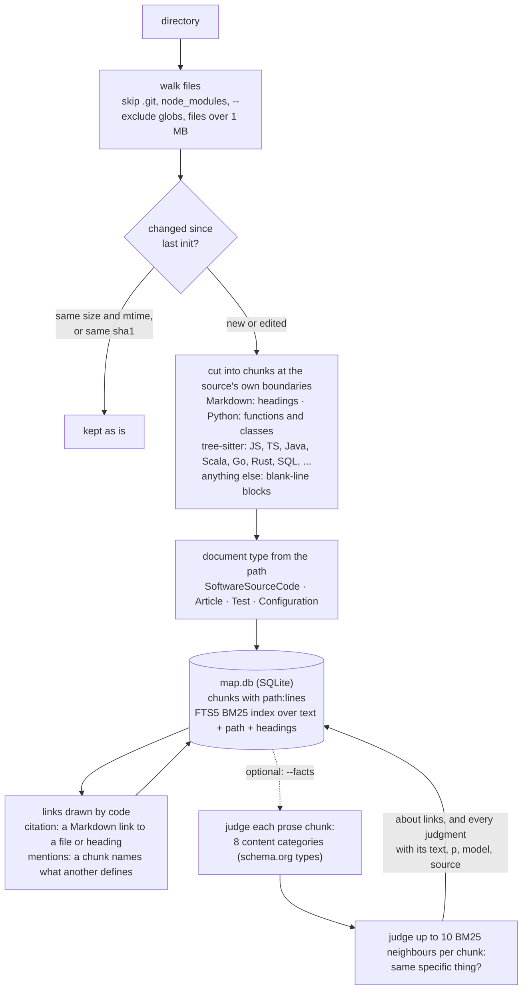
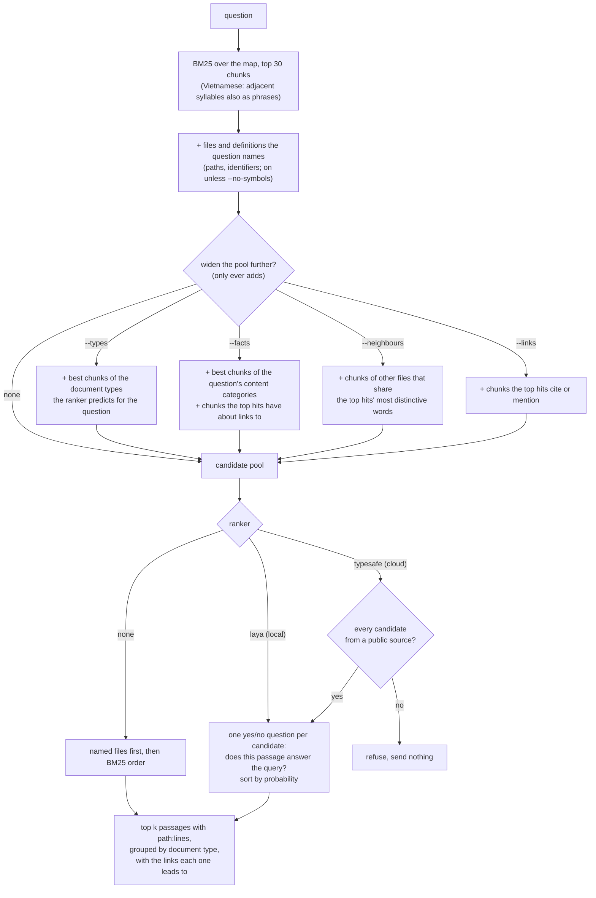

# Inventio

> *Inventio*, from *invenire*: to come upon. In classical rhetoric the orator did not make his
> material up; he went looking through the *loci*, the places where it already lay.

Inventio is a local retrieval tool for code and documents, built without embeddings. It
indexes your repositories and notes into one SQLite file and answers a question with the
original passages and their coordinates (`path:start-end`), so a person or an agent can open
the exact lines. It is the "R" of RAG; the "G" is whoever calls it.

The structure of a body of knowledge is taken from the sources themselves: their folders,
headings, function and table definitions, and the names they share. A small decision model
reorders BM25's short list, and can optionally judge which passages are about the same thing:

- [Laya](https://github.com/NandhaKishorM/laya), on your own GPU or CPU. Nothing leaves the
  machine.
- [TypeSafe Jev](https://docs.typesafe.ai), in the cloud, only for sources you mark public.

## How it works

### Ingest: `inventio init <dir>`



Everything above the dotted line is read by code, never guessed by a model. Re-running `init`
touches only what changed: on astropy (1,260 files, 22,327 chunks) the first index takes
12.8 s and a re-run after editing one file 1.4 s. `--full` rebuilds from scratch.

### Query: `inventio query "<question>"`



Looking up the names a question contains costs a few index lookups and needs no model, so it is on
by default. The other widening steps are opt-in. None of them removes a candidate: a wrong
guess costs extra candidates, never an answer BM25 had already found.

Vietnamese writes a word as several space-separated syllables (*hợp đồng*, contract), and a
syllable alone matches many unrelated words. When the question is Vietnamese, each pair of
adjacent syllables is also searched as a phrase; on Zalo legal retrieval that lifts BM25 from
0.543 to 0.756 nDCG@10.

## Install

```sh
pip install -e .               # core: standard library only (sqlite3 with FTS5)
pip install -e ".[code]"       # tree-sitter grammars, to cut Java, Scala, SQL, TS, Go ... at definitions
pip install -e ".[laya]"       # local model (torch + transformers)
pip install -e ".[typesafe]"   # cloud model; needs TYPESAFE_API_KEY
```

## Use

```sh
inventio init ~/code/fraud-rules --name rules
inventio init ~/notes/wiki --name wiki --public --exclude "drafts/*"
inventio sources

inventio query "which job recomputes customer risk overnight?"
inventio query "..." --ranker laya                   # rerank on this machine
inventio query "..." --ranker typesafe --source wiki # rerank with Jev, public sources only
inventio query "..." --json                          # for agents
```

A result shows where the passage lives and where it leads:

```
== Article
1. wiki:runbook.md:1-2  Daily scoring
   The nightly job `fraud_score_daily` recomputes customer risk before the morning review.
   -> mentions rules:jobs/score.py:1-2  (fraud_score_daily)
```

Content categories and fact links are a separate, optional step:

```sh
inventio facts --source rules                        # judged by Laya, on this machine (default)
inventio facts --source wiki --judge typesafe        # judged by Jev, public sources only
inventio query "..." --ranker laya --facts
```

The map lives in your user cache (`%LOCALAPPDATA%\inventio\map.db`, `$XDG_CACHE_HOME` or
`~/.cache`), never inside an indexed repository. Override it with `--db` or `INVENTIO_DB`; set
defaults with `INVENTIO_RANKER` and `INVENTIO_JUDGE`.

## What the map holds

- **Chunks** cut where the source already has a boundary, each with its file path and heading
  path indexed next to its text, so BM25 matches on where a passage sits as well as on what it
  says. A `CREATE TABLE` or `CREATE VIEW` is one chunk named by its table.
- **Document types**, one per file, decided from the path: `SoftwareSourceCode` and `Article`
  (schema.org), `Test` and `Configuration`.
- **Links drawn by code**, named with schema.org's vocabulary. `citation`: a Markdown link,
  resolved to the chunk it points at. `mentions`: a chunk names an identifier another chunk
  defines, or chunks in different files share a rare identifier-shaped token
  (`fraud_score_daily`, `FRAML-123`). This is what connects a repository to the prose written
  about it, across sources.
- **Content categories and `about` links** (only after `facts`). Each prose chunk is asked one
  yes/no question per schema.org top-level type (`Event`, `Person`, `Organization`, `Place`,
  `Product`, `Action`, `Intangible`, `CreativeWork`), with criteria that separate "states
  something about a specific X" from "names an X in passing"; it keeps the types with
  p ≥ 0.5, at most three. Up to 10 BM25 neighbours in other files that share a kept type are
  asked whether both passages state something about the same specific thing; the pairs judged
  true become `about` links. Jev takes two calls per chunk, one for the eight categories and
  one for all neighbours; on 100 SciFact pairs the packed call agreed with one call per pair
  on 97% of decisions.
- **Judgments.** Every model decision is stored with the text it read, its probability, the
  model name and the source, so a rebuilt map pays nothing twice.

## Benchmarks

All numbers are nDCG@10 on every test query of public benchmarks, run through Inventio's
real ingest and query path. 1.0 means every right answer is at the top. Method, per-model
sources and one-command reproduction: [benchmarks/README.md](benchmarks/README.md).

- [SWE-bench Lite](https://arxiv.org/abs/2406.14497): a GitHub issue; find the code files its
  fix touches (300 issues).
- [SciFact](https://arxiv.org/abs/2104.08663): a scientific claim; find the abstract that
  settles it (300 claims).
- [StackOverflow QA](https://arxiv.org/abs/2407.02883): a question; find its top-voted answer,
  prose and code mixed (1,994 questions).

### Against published retrievers

| System | Runs on | SWE-bench Lite | SciFact | StackOverflow QA |
|---|---|---|---|---|
| **Inventio + Jev** | CPU + TypeSafe cloud, ~1.2 s/query | **0.696** | **0.765** | 0.791 |
| **Inventio + Laya**, fine-tuned | laptop GPU, 0.4-0.9 s/query | 0.602 | 0.684 | 0.698 |
| **Inventio**, no model | CPU, 35-140 ms/query | 0.540 | 0.670 | 0.670 |
| **Inventio + Laya**, zero-shot | laptop GPU, 0.6-0.9 s/query | 0.391 | 0.302 | 0.193 |
| E5-Mistral 7B | 7B embedder | – | 0.764 | **0.915** |
| SFR-Embedding-Mistral 7B | 7B embedder | 0.627 | – | – |
| Voyage-Code-2 | Voyage cloud | 0.291 | – | 0.877 |
| Jina-v2-code | 161M embedder | 0.583 | – | – |
| BGE-base | 110M embedder | 0.449 | 0.740 | 0.736 |

Published figures come from CodeRAG-Bench, CoIR and the models' MTEB cards; – means not
reported on that benchmark.

- **Without any model**, Inventio is ahead of BGE-base and Voyage-Code-2 on SWE-bench Lite;
  only the code-trained Jina-v2-code and the 7B model are ahead of it. The likely reason, not
  isolated by an ablation, is that chunks follow functions and carry their file path. On
  plain text it stays below the embedders.
- **With Jev** reordering BM25's 30 candidates, it has the best SWE-bench Lite score in the
  table (the file to fix is first for 56% of issues, in the top 5 for 78%) and matches a 7B
  embedder on SciFact. On StackOverflow QA the answer is among the 30 candidates for only 80%
  of questions, so no reordering can pass 0.805: the candidate pool is the limit there.
- **Laya out of the box** ranks worse than BM25 alone. Its author describes it as "a fast
  base to specialise", and this agrees. Fine-tuned on human labels it moves ahead of BM25,
  including on SWE-bench code it never trained on, and stays about 0.09 behind Jev; see
  [Fine-tuning Laya](#fine-tuning-laya).
- The published figures are single-stage embedders over the whole corpus; Inventio with a
  ranker is two-stage. The BEIR paper's two-stage figure, a cross-encoder reranking the top
  100, is 0.688 on SciFact.
- On whole repositories (code, tests, docs and configs indexed together) SWE-bench Lite drops
  to 0.511 with Jev, because tests and docs crowd the files to fix out of the 30 candidates.
  `--types` recovers 0.627, against 0.560 for a plain BM25 pool of the same size. Looking up
  the files and definitions the issue names puts the file to fix among the candidates for 73%
  of issues instead of 63%, for three more candidates on average. Ranked by the fine-tuned
  Laya that gives 0.495 against 0.430 for a BM25 pool of the same size (95% CI of the gain
  +0.037 to +0.097); with no ranker, the named files first, 0.456 against 0.401.

### Do content categories and fact links help?

Each query's pool is built three ways and ranked by the same model: plain BM25 (30), BM25 plus
`--facts`, and BM25 with as many candidates as the `--facts` pool. The third arm tells a
better pool apart from a merely bigger one. Jev judged the categories of every chunk and every
candidate link pair.

| Benchmark | Ranker | BM25 30 | + facts | BM25, same size | facts vs same size (95% CI) |
|---|---|---|---|---|---|
| SciFact | Jev | 0.765 | **0.771** | 0.769 | +0.002 (−0.003, +0.007) |
| SciFact | Laya fine-tuned | **0.684** | 0.677 | 0.675 | +0.001 (−0.003, +0.006) |
| SciFact | Laya zero-shot | **0.302** | 0.249 | 0.252 | −0.004 (−0.012, +0.005) |
| StackOverflow QA | Jev | 0.791 | **0.811** | 0.806 | +0.005 (−0.001, +0.011) |
| StackOverflow QA | Laya fine-tuned | **0.698** | 0.676 | 0.697 | −0.021 (−0.028, −0.015) |
| StackOverflow QA | Laya zero-shot | **0.193** | 0.157 | 0.156 | +0.001 (−0.002, +0.004) |

Answer among the candidates: SciFact 84.9% (BM25 30), **87.6%** (+ facts), 86.3% (same size);
StackOverflow QA 80.5%, **83.1%**, 82.4%. Pools grow from 30 to about 47 candidates.

- Categories and links do find answers BM25 missed, more than the same number of extra BM25
  candidates.
- Ranked by Jev, the gain over a same-size BM25 pool is +0.002 on SciFact and +0.005 on
  StackOverflow QA, both with an interval across zero. The improvement is a bigger pool, not
  a better one, so `--facts` stays opt-in.
- Laya, zero-shot or fine-tuned, does no better with the bigger pools: it misranks the added
  candidates. The likely reason is that its training negatives were all BM25 candidates, never
  passages reached through a category or a link.

Fact links start from a candidate generator that needs no model: for each top hit, BM25 over
its most distinctive words finds chunks of other files. Jev then keeps the pairs it judges to
be about the same thing. Ranking the unjudged candidates (`--neighbours`) against the judged
ones (`about` links) asks whether the judgment earns its calls:

| Benchmark | Ranker | about links (judged) | neighbours (unjudged) | neighbours − about (95% CI) |
|---|---|---|---|---|
| SciFact | Jev | 0.769 | **0.785** | +0.015 (+0.004, +0.030) |
| SciFact | Laya fine-tuned | 0.681 | **0.690** | +0.009 (−0.001, +0.023) |
| StackOverflow QA | Jev | **0.803** | 0.796 | −0.007 (−0.012, −0.002) |
| StackOverflow QA | Laya fine-tuned | 0.677 | **0.686** | +0.009 (+0.004, +0.015) |

Pools: about 37 candidates with judged links, 40 with neighbours. In three of the four cells
the ranker does better choosing among the raw neighbours than among the ones Jev kept, so the
judgment is not paying for itself yet. `--neighbours` is opt-in because it only helps with a
ranker to reorder what it adds.

## Fine-tuning Laya

Laya runs locally, so it is the ranker for private sources, but out of the box it is not
usable. `benchmarks/finetune_laya.py` trains it on the one question the ranker asks (does this
passage answer the query?), from labels written by people, never by a model:

- **Relevance.** The train splits of SciFact (English science), StackOverflow QA (English, code)
  and [Zalo legal text retrieval](https://huggingface.co/datasets/GreenNode/zalo-ai-legal-text-retrieval-vn)
  (Vietnamese questions over Vietnamese law). Each train query gives its annotated answers as
  positives and four of BM25's 30 candidates that are not answers as hard negatives.
- **Titles.** A document's own title as the query and its first passage, heading removed, as
  the answer, against BM25's candidates for that title from other documents (SciFact paper
  titles, Zalo article titles).

```sh
python benchmarks/data.py zalo                          # Zalo legal, with its train split
python benchmarks/beir_bench.py zalo-legal --rankers none  # builds its map (and the BM25 score)
python benchmarks/finetune_laya.py --time-steps 60      # time 60 batches, print the projected run
python benchmarks/finetune_laya.py                      # fine-tune on the local GPU
export INVENTIO_LAYA_MODEL=~/.cache/inventio/laya-tuned  # Inventio now loads the tuned Laya
```

Test queries, and the documents that answer them, never enter training. 10% of the train
queries and titles are held out: half fits the temperature, half is the report (AUC, and nDCG@10
of their 30 candidates reordered against BM25's order), for the published Laya and the tuned
one. Half of the training passages lose their path, so file names and document ids are not a
cue; passages longer than Laya reads are dropped instead of cut, so no label describes text the
model never saw. The training loop is the one in the Laya author's fine-tuning notebook, ported
to a single GPU with the token embeddings frozen.

One epoch over 70,994 items (9,006 more were dropped as too long) took 48 minutes on an RTX
5070 laptop GPU. On the test sets, every query, Laya reordering the same BM25 30:

| Benchmark | BM25 | Laya zero-shot | Laya fine-tuned | fine-tuned − BM25 (95% CI) | Jev |
|---|---|---|---|---|---|
| Zalo legal, Vietnamese (788) | 0.756 | 0.512 | **0.817** | +0.061 (+0.042, +0.082) | not run |
| StackOverflow QA (1,994) | 0.670 | 0.193 | 0.698 | +0.028 (+0.015, +0.042) | **0.791** |
| SciFact (300) | 0.670 | 0.302 | 0.684 | +0.013 (−0.022, +0.049) | **0.765** |
| SWE-bench Lite `code` (300), not trained on | 0.540 | 0.391 | 0.602 | +0.062 (+0.025, +0.098) | **0.696** |
| SWE-bench Lite `mixed` (300), not trained on | 0.401 | 0.264 | 0.426 | +0.025 (−0.004, +0.055) | **0.515** |

- The fine-tune turns Laya from worse than BM25 into better than BM25 on every set. The gain
  is clear on Zalo, StackOverflow QA and SWE-bench `code`; on SciFact and whole repositories
  it is within the noise.
- SWE-bench was not in the training data at all, and there the file to fix is first for 44% of
  issues instead of BM25's 38%, so the gain is not a memory of the training sets' topics.
- On the held-out train queries, telling an answer from a non-answer (AUC) rose from 0.60-0.79
  to 0.90-0.96, and to 1.00 on titles.
- Jev stays about 0.09 ahead on the English sets. For private sources, where Jev cannot be
  used, the fine-tuned Laya is the ranker to use: 0.4-0.9 s per query, nothing leaves the
  machine.

Dataset terms travel with a checkpoint tuned on them: SciFact claims are CC BY 4.0 and its
abstracts ODC-By 1.0, StackOverflow content is CC BY-SA 4.0, and the Zalo card says MIT. No tuned
checkpoint is distributed here.

## Privacy

- Every source is private unless you pass `--public` to `init`.
- `--ranker typesafe` refuses (exit code 3) when any candidate, including one added by
  `--facts` or `--links`, comes from a private source, and sends nothing. With `--types` it
  refuses as soon as any source in scope is private, because that pool can reach any of them.
  `--facts --judge typesafe` at query time sends only the question text, to predict its
  categories.
- `facts --judge typesafe` refuses a private source the same way and judges nothing.
- With Laya as ranker and judge, the whole path runs offline.
  `python benchmarks/local_proof.py <dir> "<question>"` indexes a directory with categories
  and links, queries it with the TypeSafe key removed, and fails if any outgoing connection is
  attempted.
- The map contains source text. Keep it out of indexed trees and out of version control.

## Limitations

- Only the local file system is indexed; there are no connectors for Confluence, Slack or
  mail yet.
- Zero-shot Laya is not yet a usable judge of fact links: on a Markdown corpus it called
  2,245 of 2,261 neighbour pairs "the same thing". The fine-tuning above teaches only
  relevance, not categories or links, and the tuned ranker still misranks passages that a
  category or link brought in.
- The fine-tuned Laya is about 0.09 nDCG@10 behind Jev on the English benchmarks. It has seen
  one epoch of public data: science, programming and Vietnamese law. How well it carries to a
  team's own documents has not been measured.

## License

Apache-2.0.
