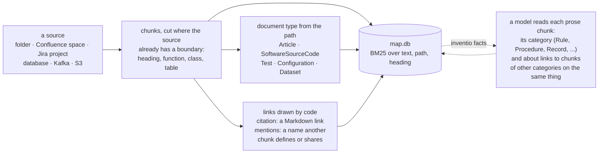
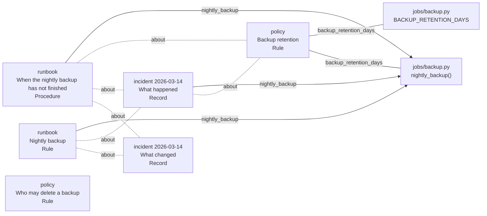
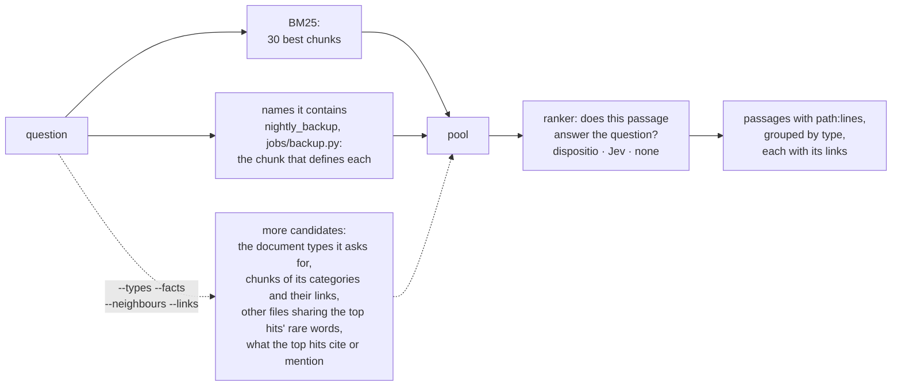

# Inventio

> *Inventio*, from *invenire*: to come upon. In classical rhetoric the orator did not make his
> material up; he went looking through the *loci*, the places where it already lay.

Inventio finds the passage that answers a question in your code, documents, Confluence pages
and Jira tickets, and tells you where it lives (`path:start-end`), so a person or an agent can
open the exact lines. It is the "R" of RAG; the "G" is whoever calls it.

It uses no embeddings. The structure comes from the sources themselves (headings, functions,
tables, the names files share), BM25 finds candidates, and a small decision model reorders them:
[dispositio](https://huggingface.co/minhquan2310/dispositio) on your own machine, or
[TypeSafe Jev](https://docs.typesafe.ai) in the cloud for sources you mark public. Everything
lives in one SQLite file.

## Quick start

The repository carries a small example: the code of an online shop's nightly database backup,
and the wiki around it, a runbook, a retention policy and an incident report.

```sh
uv tool install "inventio[laya] @ git+https://github.com/minhquan23102000/inventio"
inventio skill                   # teaches your coding agents (~/.agents/skills) to install and use inventio
git clone https://github.com/minhquan23102000/inventio && cd inventio

inventio init examples/webshop/app --name app --public     # --public: may be sent to a cloud judge
inventio init examples/webshop/wiki --name wiki --public
inventio query "the nightly backup has not finished, what do I do?" -k 3
```

```
== Article
1. wiki:runbook.md:8-13  Nightly backup runbook > When the nightly backup has not finished  p=0.98
   1. Check the scheduler at 07:00. If `nightly_backup` is still running or has failed, stop it. 2. Take a fresh backup from the replica, not the primary: `make ba…
   -> mentions app:jobs/backup.py:4-9  (nightly_backup)
3. wiki:runbook.md:3-6  Nightly backup runbook > Nightly backup  p=0.88
   The job `nightly_backup` copies the orders database to off-site storage. It starts at 01:00 and must finish before the morning order peak at 08:00.
   -> mentions app:jobs/backup.py:4-9  (nightly_backup)
== SoftwareSourceCode
2. app:jobs/backup.py:4-9  nightly_backup  p=0.92
   def nightly_backup(db, storage, now): """Copy the orders database to off-site storage every night, before the morning order peak.""" snapshot = db.snapshot(as_o…
   -> mentions wiki:policy.md:3-8  (backup_retention_days)
   <- mentions wiki:incidents/2026-03-14.md:3-8  (nightly_backup)
   <- mentions wiki:runbook.md:3-6  (nightly_backup)
```

The runbook's steps come first; `p` is dispositio's probability that the passage answers, and
results are grouped by document type, numbered by rank. The line under each was drawn by code,
not by a model: the runbook names `nightly_backup` and `jobs/backup.py` defines it, so the
answer arrives with the code of the job it is about, from another source.

A list of steps says what to do, not why. `inventio facts` has a model read every prose chunk
once: what it does for its reader (its category), and which chunks of other kinds speak about
the same thing (`about` links).

```sh
inventio facts --judge typesafe     # Jev: TYPESAFE_API_KEY, public sources only
inventio query "why do we check the backup scheduler at 07:00?" -k 2 --facts
```

```
== Article
1. wiki:runbook.md:8-13  Nightly backup runbook > When the nightly backup has not finished  p=0.96
   1. Check the scheduler at 07:00. If `nightly_backup` is still running or has failed, stop it. 2. Take a fresh backup from the replica, not the primary: `make ba…
   -> mentions app:jobs/backup.py:4-9  (nightly_backup)
   -> about wiki:incidents/2026-03-14.md:10-13  (Procedure~Record)
   -> about wiki:policy.md:3-8  (Procedure~Rule)
2. wiki:incidents/2026-03-14.md:10-13  Incident 2026-03-14: no backup to restore > What changed  p=0.93
   The 07:00 scheduler check was added to the runbook, and the job now pages the on-call engineer when it has not finished by 06:30 or when the bucket is more than…
   <- about wiki:runbook.md:8-13  (Procedure~Record)
   <- about wiki:runbook.md:3-6  (Record~Rule)
```

The why is in the incident report: the check was added after the night a backup filled its
bucket at 03:40 and stopped without an error. From one step of a runbook the map reaches the
code it runs, the rule it serves and the failure that put it there. Without `--judge`,
dispositio judges offline: here it gives five of the six chunks the category Jev gives, but it
links every pair it is asked about (see [Limitations](#limitations)).

`uv tool install` puts `inventio` on your PATH for every terminal; `uvx --from "inventio[laya] @
git+https://github.com/minhquan23102000/inventio" inventio ...` runs it once without installing.
Without `[laya]` it installs in seconds and ranks by BM25 alone; `[laya]` adds dispositio,
downloaded once from Hugging Face, and PyTorch (the CPU build unless you install a CUDA one).
A package install cannot write outside its own environment, so the agent skill is copied by
`inventio skill` (or `inventio skill --project` for this repository's `.agents/skills`); run it
again after an upgrade to refresh it.

## How it works

### Ingest



Everything on a solid arrow is decided by code from what the source says; the dotted step is
the only one a model takes, only when asked, and it adds labels and links without changing a
chunk. A re-run reads only the files that changed: astropy (22,327 chunks) indexes in 12.8 s,
and again after one edit in 1.4 s. On `examples/webshop` the map is this graph:



Solid lines are names, found by code. Dotted lines are the `about` links Jev judged true, 6 of
the 10 pairs it was asked about; "Who may delete a backup" is linked to nothing, since it is
about a different act. The categories are Jev's too; it calls the runbook's opening section a
Rule, with p=0.38.

### Query



The pool only grows and the ranker only orders it: a passage that neither BM25 nor the names
brought in cannot come out. Looking up names needs no model and is on by default
(`--no-symbols` turns it off); on whole SWE-bench repositories it puts a file to fix among the
candidates for 73% of issues instead of 63%. The four dotted options are off by default;
[benchmarks/README.md](benchmarks/README.md) measures what each adds. A Vietnamese question is
also searched as pairs of adjacent syllables, since *hợp đồng* (contract) is two words to BM25.

## What the map holds

- **Chunks** with their file path and heading path indexed next to the text, so BM25 matches
  where a passage sits as well as what it says.
- **Document types** from the path: `SoftwareSourceCode`, `Test`, `Configuration`, `Article`,
  and `Dataset` for the card of a table, topic or data file (see [Where the data lives](#where-the-data-lives)).
- **Links drawn by code.** `citation`: a Markdown link, resolved to the chunk it points at.
  `mentions`: a chunk names what another defines, or two files share a rare identifier
  (`nightly_backup`, `SHOP-812`). This connects code to the prose written about it.
- **Categories** (after `inventio facts`): what a prose chunk does for its reader.

  | Category | The passage | A question it answers |
  |---|---|---|
  | Rule | states what must, may or must not be done | "is it allowed to...", "what is the limit" |
  | Procedure | walks through how to do something | "how do I..." |
  | Reference | describes what something is or contains, for lookup; every `Dataset` card is filed here by code, not judged | "what are the fields of...", "which table holds..." |
  | Explanation | explains why or how something works | "why does..." |
  | Finding | reports what was measured or observed | "does it work", "how much faster" |
  | Record | tells what happened or was decided | "when did this change", "what broke last time" |
  | Other | none of these: a table of contents, credits, boilerplate | |

  Categories cut a corpus into regions instead of all covering it, so `--facts` widens toward
  the kind of passage the question wants. `about` links join passages of different categories
  that state something about the same thing: the rule, the runbook that carries it out, the
  incident that broke it.
- **Judgments.** Every model decision is stored with the text it read, so a rebuilt map pays
  nothing twice.

## Working with a result

```sh
inventio read app:jobs/backup.py:4-9          # the lines
inventio show wiki:runbook.md:8-13            # what the map knows: type, category, links, sections around
inventio grep "nightly_backup"                # every line that says it: code, pages, tickets
inventio ls wiki                              # a source like a folder; a file lists its sections
inventio sync                                 # folders re-read, pages and tickets: only what changed
```

```
$ inventio show wiki:runbook.md:8-13
wiki:runbook.md:8-13  Nightly backup runbook > When the nightly backup has not finished
  Article (by path) · markdown · public
  section 8-13 · Procedure p=1.00 (jev-latest) · mentions 1 name
links
  -> mentions app:jobs/backup.py:4-9  nightly_backup  · SoftwareSourceCode  (nightly_backup)
  ~  about    wiki:incidents/2026-03-14.md:10-13  Incident 2026-03-14: no backup to restore > What changed  · Article · Record p=1.00 (jev-latest)  p=0.93 (jev-latest)
  ~  about    wiki:policy.md:3-8  Data retention policy > Backup retention  · Article · Rule p=1.00 (jev-latest)  p=0.65 (jev-latest)
  ~  about    wiki:incidents/2026-03-14.md:3-8  Incident 2026-03-14: no backup to restore > What happened  · Article · Record p=1.00 (jev-latest)  p=0.84 (jev-latest)
structure
  < wiki:runbook.md:3-6  Nightly backup runbook > Nightly backup  · Article · Rule p=0.38 (jev-latest)
```

`query` is for a question, `show` for where a result leads, `grep` for an exact name (every
caller, every page citing a ticket), `ls` for seeing what is there. Each prints coordinates
that `read` and `show` open, and `read` also takes a page or ticket URL someone pasted in chat;
`inventio -h` shows the same walk. `show` labels every fact with what decided it: the path or a
link (code), or a model with its probability (category, `about`). `--json` gives the same for
agents.

All sources share one map, so a query and the links reach across them (the job in `app`, the
runbook in `wiki`, a ticket in Jira), and `--db` or `INVENTIO_DB` keeps a separate map. It lives
in your user data directory (`%LOCALAPPDATA%\inventio`, `~/Library/Application Support/inventio`,
or `~/.local/share/inventio`), never inside an indexed repository.

### Narrowing a search

```sh
inventio query "why no backup" -w "kind:jira -status:Done updated:>=-90d"
inventio query "retention" -w "path:Ops/* type:Article"
inventio grep "nightly_backup" -w "source:app,wiki"
```

`-w` (on `query`, `grep` and `bench`) decides what a search may look at before BM25 runs, the way
GitHub's search box reads: `key:value` terms separated by spaces all hold, `a,b` is either value,
`-key:value` negates, `>=` `>` `<=` `<` compare (dates are ISO; `-90d` and `-2w` count back from
today), `*` is a wildcard, quotes hold a value with spaces (`assignee:"Nguyen An"`), and case does
not matter. Every way into the pool (names the question uses, predicted types and categories,
neighbours, links) keeps to it, so the 30 candidates are all spent inside the scope.

Every map has `source`, `kind` (`dir`, `confluence`, `jira`, `github`, `sql`, `kafka`, `s3`),
`type`, `lang`, `path` and `category`. Connectors add their items' fields: Jira `status`,
`resolution`, `issuetype`, `priority`, `assignee`, `reporter`, `labels`, `project`, `created`,
`updated`; Confluence `space`, `author`, `editor`, `labels`, `created`, `updated`; GitHub `repo`,
`item` (`issue` or `pull`), `state` (`open`, `closed`, `merged`, `draft`), `author`, `assignee`,
`labels`, `milestone`, `created`, `updated`, `closed`. A chunk without the field does not match a
term on it and does match its negation, so `-status:Done` keeps the code. A key the map does not
hold is an error that lists the keys it does; a scope with nothing in it says so instead of "no
match". `--source NAME` is `-w source:NAME`.

## Sources

### Folders

`inventio init <dir>` indexes a directory; code is cut at its functions and classes
(tree-sitter), Markdown and text at their headings. `sync` or another `init` re-reads only the
files whose size, time or content changed.

### Signing in once

```sh
inventio login https://<site>.atlassian.net            # asks email and API token, tries them, keeps them
inventio login postgresql://reader@db.internal/core    # asks the password, connects once, keeps it
inventio sources                                       # each source's login: keyring, env, gh, driver or missing
inventio logout https://<site>.atlassian.net
```

A login is kept in the operating system's keychain (Windows Credential Manager, macOS Keychain,
Secret Service), never in the map, a mirror or a file beside your code, so `init` and `sync` work
from any directory. It is kept per place: every space and project of one Atlassian site shares
one login, and two sites keep two. `init` on a terminal asks for a login it does not have; run
by an agent or a script it stops and names the `inventio login` to run. Variables still come
first (`ATLASSIAN_EMAIL` and `ATLASSIAN_API_TOKEN`, `INVENTIO_SQL_PASSWORD`, the driver's own
`PGPASSWORD`), for CI and agents handed their credentials. GitHub signs in through the GitHub
CLI. A Linux machine without a keychain service has only the variables.

### Confluence and Jira

```sh
inventio init https://<site>.atlassian.net/wiki/spaces/OPS            # a Confluence space -> wiki-OPS
inventio init https://<site>.atlassian.net/browse/SHOP --jql "updated >= -365d"   # Jira -> jira-SHOP
```

Every request runs as the person who signed in, so a mirror holds only what they may read.

A remote source is mirrored as Markdown under the data directory, one file per page or ticket,
and indexed like a folder: the same chunks, links and judgments.

- **Pages** keep the page tree as folders. Links between pages of the space become `citation`
  links; `include` becomes a link to the page it pulls from; code stays code; tables stay
  tables, long ones repeating their header. Images and embedded diagrams (Lucidchart, Figma,
  draw.io) are not read but keep their place as ``.
- **Tickets** are records: summary, status and people, links to other tickets, the
  description, then every comment under its own heading. A file named after its key defines
  it, so a page or a line of code that says `SHOP-812` links to the ticket.
- **Sync** lists each item's version (page version, ticket update time) without its body,
  fetches only what changed, moves renamed pages and deletes what is gone.
- **Results** carry the web address of their heading or comment beside the coordinate.
  `inventio read` takes either: a coordinate, or a page or ticket URL, read from the mirror
  when it is there and fetched live (not added to the map) when it is not. `inventio show`
  follows the links, so an agent can walk from a rule to its code to its incident.

Connectors live in `inventio/connectors/`: one module per kind lists items with a version and
turns one item into Markdown; mirroring, indexing and `read` are shared, so mail or chat is
one more module.

### GitHub issues and pull requests

```sh
gh auth login                                        # once, if the GitHub CLI is not signed in yet
inventio init https://github.com/acme/shop           # -> gh-shop
inventio query "why read from the replica" -w "item:pull state:merged"
```

Inventio keeps no GitHub token; each run asks the GitHub CLI for the one it holds (`gh auth
token`), for github.com and for a GitHub Enterprise host the CLI is signed in to (`GH_TOKEN`,
`GITHUB_TOKEN` or `GH_ENTERPRISE_TOKEN` without the CLI). One file per issue or pull request: the
description, the comments, and for a pull request its reviews and every review comment under a
heading with the file and line it is on and the last lines of its diff. `#12` and links to the
repository's own items become relative links, so they are `citation` links in the map; the file
defines `shop#12` and `acme/shop#12`, so a page or ticket that writes `acme/shop#12` links to it.
Sync lists every item with its update time and fetches only what changed. The code is not
fetched: index your clone with `inventio init <dir>`.

### Where the data lives

```sh
uv tool install "inventio[laya,data] @ git+https://github.com/minhquan23102000/inventio" --with psycopg2-binary
#   DuckDB, SQLAlchemy, Kafka, boto3, and your database's driver in the same environment (pymysql for MySQL ...)
inventio init postgresql://reader@db.internal/core  # password from `inventio login`, INVENTIO_SQL_PASSWORD or PGPASSWORD
inventio init "kafka://broker:9092?registry=http://registry:8081"
inventio init s3://lake/warehouse/                  # AWS_* variables; AWS_ENDPOINT_URL for MinIO and the like
```

A runbook says "the job copies the orders database" without saying where. Each table, view, Kafka
topic, S3 dataset and local data file (`.parquet`, `.csv`, `.tsv`, `.jsonl`) becomes one
Markdown card: where to connect, the columns with their types and comments, keys and indexes,
a view's definition, a topic's partitions, retention and value schema. Only the catalog is read,
never a row; a topic without a registered schema has one message read for its field names and
types, and its values are not kept. A database password is never written to the map.

A card defines its table's name, so code, SQL, dbt models, runbooks and tickets that say
`shop.orders` link to it, and a foreign key is a link from one card to the other.
Cards are `Dataset` documents filed under `Reference` by code, never sent to a model. BM25
finds a card by its name and its column comments; a card without comments is best reached
through `inventio show` from the code or runbook that names it. S3 folders like `dt=2026-09-24/`
are partitions of one dataset, not datasets of their own.

## dispositio

[dispositio](https://huggingface.co/minhquan2310/dispositio), the second canon of rhetoric
after *inventio*, is [Laya](https://github.com/NandhaKishorM/laya) (mmBERT-base, 322M) fine-tuned
for the two questions Inventio asks: does this passage answer the query, and what does this
passage do for its reader. It runs on a laptop GPU or a CPU and nothing leaves the machine.

```sh
inventio query "..."                      # dispositio ranks by default, downloaded once from Hugging Face
inventio facts --source wiki              # categories, judged by dispositio
```

`--ranker laya` is Laya as published, `--ranker none` BM25 order. `INVENTIO_DISPOSITIO_MODEL`
points `dispositio` at another checkpoint: a directory or a Hugging Face id, such as a fine-tune
of your own.

The first query with dispositio starts a server in the background that keeps the model loaded,
so later queries skip importing PyTorch and loading the model (about 5 s on a laptop). It
listens on 127.0.0.1 only, answers only requests carrying the token in `serve.json` in the data
directory, and exits after 15 minutes without a request (`INVENTIO_SERVE_IDLE`, in seconds).
`INVENTIO_SERVE=0` runs every query in its own process; `inventio serve --stop` stops it.

Relevance labels are written by people: the train splits of MultiDoc2Dial (questions about the
pages of US public services: rules, eligibility, procedures), StackOverflow QA, SciFact and Zalo
legal, and 3,923 SWE-bench train issues paired with the code their fix changed (35 repositories,
none of them in SWE-bench Lite). Category labels, for which no human set exists, are a small
general model's. `benchmarks/finetune_laya.py` reproduces it in two stages, about an hour on an
RTX 5070 laptop GPU; results, training data and terms are on the model card.

## Benchmarks

nDCG@10 on every test query, through Inventio's real ingest and query path; the rankers reorder
the same 30 BM25 candidates. Method and reproduction: [benchmarks/README.md](benchmarks/README.md).

| System | Runs on | SWE-bench Lite | SciFact | StackOverflow QA | Zalo legal | MultiDoc2Dial | TechQA |
|---|---|---|---|---|---|---|---|
| **Inventio + Jev** | TypeSafe cloud, ~1.2 s/query | **0.696** | **0.765** | 0.791 | not run | 0.486 | **0.655** |
| **Inventio + dispositio** | laptop GPU, 0.4-0.9 s/query | 0.661 | 0.728 | 0.590 | **0.830** | **0.643** | 0.444 |
| **Inventio**, no model | CPU, 35-140 ms/query | 0.540 | 0.670 | 0.670 | 0.756 | 0.470 | 0.370 |
| **Inventio + Laya**, not tuned | laptop GPU, 0.6-0.9 s/query | 0.391 | 0.302 | 0.193 | 0.512 | 0.389 | 0.171 |
| E5-Mistral 7B | 7B embedder | – | 0.764 | **0.915** | – | – | – |
| SFR-Embedding-Mistral 7B | 7B embedder | 0.627 | – | – | – | – | – |
| Voyage-Code-2 | Voyage cloud | 0.291 | – | 0.877 | – | – | – |
| Jina-v2-code | 161M embedder | 0.583 | – | – | – | – | – |
| BGE-base | 110M embedder | 0.449 | 0.740 | 0.736 | – | – | – |

SWE-bench Lite: a GitHub issue, find the code files its fix touches (300 issues). SciFact: a
claim, find the abstract that settles it (300). StackOverflow QA: a question, find its accepted
answer (1,994). Zalo: a Vietnamese question, find the law article (788). MultiDoc2Dial: a
question about a US public-service page, find the section that answers (615). TechQA: a question
from IBM's support forums, find the passage of the technote that answers (119). Published
figures come from CodeRAG-Bench, CoIR and the models' MTEB cards; they are single-stage
embedders over the whole corpus, while Inventio with a ranker is two-stage.

- **No model**: ahead of BGE-base and Voyage-Code-2 on SWE-bench Lite. The likely reason, not
  isolated by an ablation, is that chunks follow functions and carry their file path. On plain
  text it stays below the embedders.
- **dispositio**, on a laptop: ahead of BM25 with the 95% interval above zero on SWE-bench Lite
  (+0.121), MultiDoc2Dial (+0.172), Zalo (+0.074), TechQA (+0.074) and SciFact (+0.058), and
  ahead of every embedder listed on SWE-bench Lite, whose 12 repositories it never trained on.
  On the student aid pages of MultiDoc2Dial, held out of training whole, it gains +0.143 and
  finds the answering section among its page's other sections for 80% of questions (Jev 57%).
- **StackOverflow QA** puts its train and test answers in one corpus: 70% of the wrong
  candidates a test question sees are answers dispositio was trained on as answers, and it
  ranks them too high. With them removed from the candidates it is ahead of BM25 (0.752 against
  0.729, +0.024 with the interval above zero); a team's own documents were never in training.
- **Jev** stays ahead on SWE-bench, SciFact, StackOverflow QA and above all TechQA, where the
  answer is one section of a long technote.
- **Laya as published** ranks worse than BM25 alone, which is why dispositio exists.
- **Whole repositories** (code, tests, docs and configs indexed together) are harder: BM25 0.400,
  dispositio 0.486, Jev 0.515. Tests and docs crowd the files to fix out of the 30 candidates;
  looking up the names the issue contains puts the file among them for 73% of issues instead of
  63%.
- **[examples/webshop](examples/webshop)**, 13 on-call questions over a runbook, a policy, an
  incident report and code, written after training (`python benchmarks/example_bench.py none
  dispositio typesafe`): the answer is first for 9 with dispositio, 6 with BM25, 13 with Jev.

## Privacy

- Every source is private unless `init` gets `--public`.
- Jev refuses (exit code 3) and sends nothing when any candidate comes from a private source;
  `facts --judge typesafe` refuses a private source the same way.
- With dispositio as ranker and judge the whole path runs offline;
  `python benchmarks/local_proof.py <dir> "<question>"` fails if any connection is attempted.
- The map holds source text. Keep it out of indexed trees and version control. Mirrors of
  Confluence, Jira and GitHub live beside it in the data directory; `drop` deletes a source's mirror.
- Logins live in the operating system's keychain (`inventio login`), never in the map or a mirror.

## Limitations

- Directories, Confluence Cloud, Jira Cloud, GitHub issues and pull requests, and the schemas of
  SQL databases, Kafka topics and S3 datasets; no Slack, mail, GitHub Discussions or wiki yet.
  Sync is on demand (`inventio sync`); nothing listens for changes. A dbt project is read as its
  SQL files, not yet its `manifest.json` descriptions.
- A GitHub sync lists the whole repository and asks two more requests per changed pull request
  (reviews, review comments) and one per issue with comments: a repository of a few thousand
  items may meet the API's hourly limit on its first sync, which stops there and resumes on the
  next. A bare `#12` in code or in another source names no repository and links nowhere.
- Filtering by a connector's fields needs mirrors written by this version: the first `sync`
  after upgrading fetches every Confluence page and Jira ticket once more.
- Text inside images, diagrams and attached files is not read.
- dispositio misses a paraphrase that needs an inference ("without loading the main database"
  for "from the replica") and finds one step of a numbered list less often than a section that
  answers whole. How well it carries to a team's own documents is measured on 13 questions only.
- `about` links need a judge of "are these two passages about the same thing". dispositio was
  not trained for it, and Laya as published calls nearly every pair the same; use Jev for links.
- The categories above are new. Whether `--facts` with them finds answers a same-size BM25 pool
  does not is not measured yet; the earlier measurement, with schema.org types, is in
  [benchmarks/README.md](benchmarks/README.md#categories-and-fact-links---arms).

## License

Apache-2.0. dispositio's weights carry its training data's terms; see its model card.
