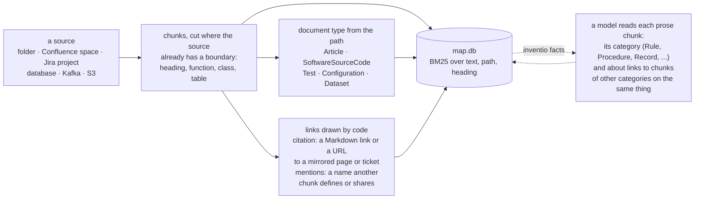
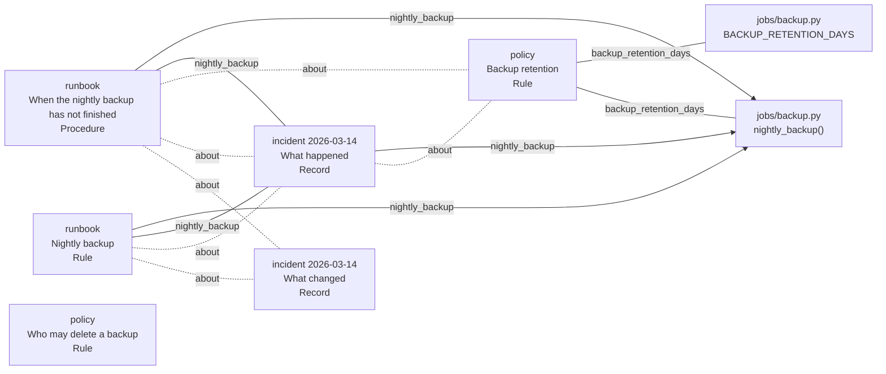
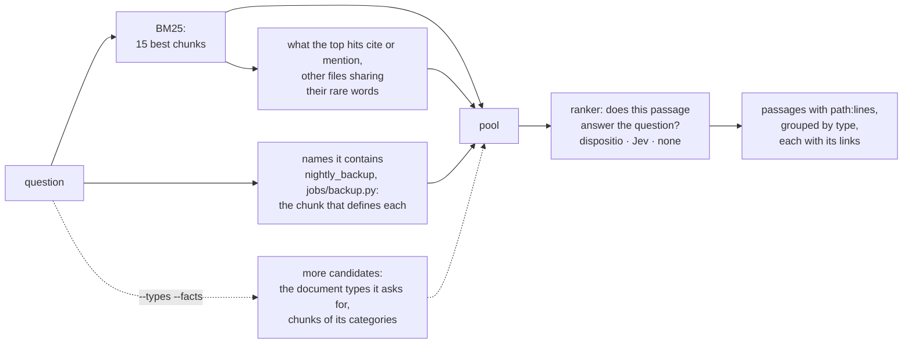

# Inventio

Inventio finds the passage that answers a question in your code, documents, Confluence pages, Jira
tickets and GitHub issues, and returns where it lives as `path:start-end`, so a person or an agent
can open the exact lines. No embeddings, no vector database; it runs on your laptop. It is the R of
RAG; the G is whoever calls it.


## Quick start

The repository carries a small example: the code of an online shop's nightly database backup,
and the wiki around it, a runbook, a retention policy and an incident report.

```sh
uv tool install "inventio[dispositio]"
inventio skill                   # teaches your coding agents (~/.agents/skills) to install and use inventio
git clone https://github.com/minhquan23102000/inventio && cd inventio

inventio init examples/webshop/app --name app --public     # --public: may be sent to a cloud judge
inventio init examples/webshop/wiki --name wiki --public
inventio query "the nightly backup has not finished, what do I do?" -k 3
```

## Why no embeddings

- **Coordinates, not similar text.** Every answer is a `path:start-end` coordinate. The links
  under a result (the code a runbook names, the incident report about the same job) come from what
  the sources literally say: a name one chunk defines and another mentions, a Markdown link, a URL
  to a mirrored page. Code draws them, not a model, so a link on screen is never a guess.
- **Measured on code search.** On SWE-bench Lite (find the files a GitHub issue's fix touches,
  300 issues, nDCG@10), inventio with no model, on a CPU at 35-140 ms per query, reaches 0.540
  against BGE-base (0.449) and Voyage-Code-2 (0.291). With dispositio, its own 0.8B ranker on a
  laptop GPU, reading BM25's top 30: 0.643 against the 7B SFR-Embedding-Mistral (0.627). Embedders
  still lead on StackOverflow QA: E5-Mistral 7B 0.915 against 0.711.
- **Nothing to host.** Everything lives in one SQLite file, with no vector database and no index
  server. `inventio sync` re-reads only the files that changed. With the local model, no query or
  document leaves the machine.

The published embedder figures are single-stage over the whole corpus; inventio with a ranker is
two-stage. See [the full table](#benchmarks).

## Use it from your coding agent

```sh
uv tool install "inventio[dispositio]"
inventio skill                   # into ~/.agents/skills; --project for this repository's .agents/skills
```

Agents that read `.agents/skills` then know how to install inventio, add sources (`init`, `sync`,
`login`), find with `query`, open with `read`, follow links with `show`, and cite coordinates
instead of paraphrasing. Run `inventio skill` again after an upgrade to refresh it.

## Reading a result

The query in [Quick start](#quick-start) prints:

```
== Article
1. wiki:runbook.md:8-13  Nightly backup runbook > When the nightly backup has not finished  p=0.96
   1. Check the scheduler at 07:00. If `nightly_backup` is still running or has failed, stop it. 2. Take a fresh backup from the replica, not the primary: `make ba…
   -> code · defines nightly_backup · app:jobs/backup.py:4-9  nightly_backup
   -> page · names nightly_backup too · wiki:incidents/2026-03-14.md:3-8  Incident 2026-03-14: no backup to restore > What happened
2. wiki:runbook.md:3-6  Nightly backup runbook > Nightly backup  p=0.03
   The job `nightly_backup` copies the orders database to off-site storage. It starts at 01:00 and must finish before the morning order peak at 08:00.
   -> code · defines nightly_backup · app:jobs/backup.py:4-9  nightly_backup
   -> page · names nightly_backup too · wiki:incidents/2026-03-14.md:3-8  Incident 2026-03-14: no backup to restore > What happened
3. wiki:incidents/2026-03-14.md:3-8  Incident 2026-03-14: no backup to restore > What happened  p=0.00
   The `nightly_backup` run filled the storage bucket at 03:40 and stopped without an error, and nobody checked the scheduler. At 11:00 a bad migration corrupted t…
   -> code · defines nightly_backup · app:jobs/backup.py:4-9  nightly_backup
   -> page · names nightly_backup too · wiki:runbook.md:3-6  Nightly backup runbook > Nightly backup
   -> page · names nightly_backup too · wiki:runbook.md:8-13  Nightly backup runbook > When the nightly backup has not finished
```

The runbook's steps come first; `p` is dispositio's probability that the passage answers, and
results are grouped by document type, numbered by rank. Each line under a result is where it
leads, and every word on it comes from the sources: what the target is (`code`, from its path),
the fact that makes the link (the runbook names `nightly_backup`, `jobs/backup.py` defines it;
the incident report names the same job), and the target's own title. No model draws or names
these links, so a link on screen is never a guess. Between tickets the verb is the ticket's
own (`is caused by SHOP-2`), and a Jira, Confluence or GitHub URL to a page or ticket the map
mirrors links to it.

A list of steps says what to do, not why. `inventio facts` has dispositio read every prose
chunk once and say what it does for its reader (its category). Links then say what waits at
the other end, `steps`, `record` or `finding`, where that judgment is confident enough (at least
0.95 agreement with the reference labels on 380 held-out passages); below that they stay `page`.

```sh
inventio facts
inventio query "why do we check the backup scheduler at 07:00?" -k 2
```

```
== Article
1. wiki:incidents/2026-03-14.md:10-13  Incident 2026-03-14: no backup to restore > What changed  p=0.92
   The 07:00 scheduler check was added to the runbook, and the job now pages the on-call engineer when it has not finished by 06:30 or when the bucket is more than…
2. wiki:incidents/2026-03-14.md:3-8  Incident 2026-03-14: no backup to restore > What happened  p=0.04
   The `nightly_backup` run filled the storage bucket at 03:40 and stopped without an error, and nobody checked the scheduler. At 11:00 a bad migration corrupted t…
   -> code · defines nightly_backup · app:jobs/backup.py:4-9  nightly_backup
   -> page · names nightly_backup too · wiki:runbook.md:3-6  Nightly backup runbook > Nightly backup
   -> steps · names nightly_backup too · wiki:runbook.md:8-13  Nightly backup runbook > When the nightly backup has not finished
```

The why is in the incident report: the check was added after the night a backup filled its
bucket at 03:40 and stopped without an error. From there the map reaches the code of the job
and the runbook step that now carries the check. `facts` also judges which chunks of different
categories speak about the same thing (`about` links); `inventio show` lists them, marked as
judged, but they are not printed under results, since a judged link can be wrong (see
[Limitations](#limitations)).

## Installing

`uv tool install` puts `inventio` on your PATH for every terminal; `uvx --from "inventio[dispositio]"
inventio ...` runs it once without installing. The unreleased `main` installs with
`"inventio[dispositio] @ git+https://github.com/minhquan23102000/inventio"`.
Without `[dispositio]` it installs in seconds and ranks by BM25 alone; `[dispositio]` adds PyTorch and
the model that ranks, judges `--facts` and predicts `--types` (1.4 GB, downloaded once from Hugging
Face on the first query). A GPU reads 15 candidates in about 0.16 s (RTX 5070 laptop); a CPU reads
them too, in about 15 s (fp32, 4,200 tokens of state). `--pool 30` reads twice as many in three passes,
about three times as long.

## How it works

It uses no embeddings. The structure comes from the sources themselves (headings, functions,
tables, the names files share), BM25 finds candidates, and a small decision model reorders them:
[dispositio](https://huggingface.co/minhquan2310/dispositio) on your own machine, or
[TypeSafe Jev](https://docs.typesafe.ai) in the cloud for sources you mark public. Everything
lives in one SQLite file.

### Ingest


```mermaid
flowchart LR
    S["a source<br/>folder · Confluence space · Jira project<br/>database · Kafka · S3"] --> C["chunks, cut where the source<br/>already has a boundary:<br/>heading, function, class, table"]
    C --> M[("map.db<br/>BM25 over text, path, heading")]
    C --> T["document type from the path<br/>Article · SoftwareSourceCode<br/>Test · Configuration · Dataset"] --> M
    C --> L["links drawn by code<br/>citation: a Markdown link or a URL<br/>to a mirrored page or ticket<br/>mentions: a name another<br/>chunk defines or shares"] --> M
    M -. "inventio facts" .-> F["a model reads each prose chunk:<br/>its category (Rule, Procedure, Record, ...)<br/>and about links to chunks<br/>of other categories on the same thing"] -.-> M
```

Everything on a solid arrow is decided by code from what the source says; the dotted step is
the only one a model takes, only when asked, and it adds labels and links without changing a
chunk. A re-run reads only the files that changed: astropy (22,327 chunks) indexes in 12.8 s,
and again after one edit in 1.4 s. On `examples/webshop` the map is this graph:


```mermaid
flowchart LR
    R8["runbook<br/>When the nightly backup has not finished<br/>Procedure"]
    R3["runbook<br/>Nightly backup<br/>Rule"]
    P3["policy<br/>Backup retention<br/>Rule"]
    P10["policy<br/>Who may delete a backup<br/>Rule"]
    I3["incident 2026-03-14<br/>What happened<br/>Record"]
    I10["incident 2026-03-14<br/>What changed<br/>Record"]
    B4["jobs/backup.py<br/>nightly_backup()"]
    B1["jobs/backup.py<br/>BACKUP_RETENTION_DAYS"]
    R8 -- "nightly_backup" --> B4
    R3 -- "nightly_backup" --> B4
    I3 -- "nightly_backup" --> B4
    P3 -- "backup_retention_days" --- B1
    P3 -- "backup_retention_days" --- B4
    R8 -- "nightly_backup" --- I3
    R3 -- "nightly_backup" --- I3
    R8 -. "about" .- P3
    R8 -. "about" .- I3
    R8 -. "about" .- I10
    I3 -. "about" .- P3
    R3 -. "about" .- I3
    R3 -. "about" .- I10
```

Solid lines are names, found by code: the page that defines a name, and pages in different files
that name the same defined thing. Dotted lines are the `about` links Jev judged true, 6 of
the 10 pairs it was asked about; "Who may delete a backup" is linked to nothing, since it is
about a different act. The categories are Jev's too; it calls the runbook's opening section a
Rule, with p=0.38.

### Query


```mermaid
flowchart LR
    Q["question"] --> B["BM25:<br/>15 best chunks"] --> P["pool"]
    Q --> N["names it contains<br/>nightly_backup, jobs/backup.py:<br/>the chunk that defines each"] --> P
    Q -. "--types --facts" .-> W["more candidates:<br/>the document types it asks for,<br/>chunks of its categories"] -.-> P
    B --> L["what the top hits cite or mention,<br/>other files sharing<br/>their rare words"] --> P
    P --> R["ranker: does this passage<br/>answer the question?<br/>dispositio · Jev · none"] --> O["passages with path:lines,<br/>grouped by type,<br/>each with its links"]
```

The pool only grows and the ranker only orders it: a passage that neither BM25 nor the names
brought in cannot come out. Looking up names needs no model and is on by default
(`--no-symbols` turns it off); on whole SWE-bench repositories it puts a file to fix among the
candidates for 73% of issues instead of 63%. With a ranker, the chunks the five best hits link to
join too (`--no-links` turns it off), up to ten; `--neighbours` also adds chunks of other files
sharing those hits' rarest words. The ranker reads up to 7 of what the names and links add, in one
more pass beside BM25's best 8. On SWE-bench Lite the names are the gain, links add little and
neighbours nothing, at 0.5 s a query (see [Limitations](#limitations)); on four public sets with
almost no links that pass does no better than giving the same seats to BM25's next 7. On a real
wiki, tracker and repository it is not yet measured. Without a ranker they are skipped, since
they would only sit below BM25's order. The two dotted options are off by default;
[benchmarks/README.md](benchmarks/README.md) measures what each adds. A Vietnamese question is
also searched as pairs of adjacent syllables, since *hợp đồng* (contract) is two words to BM25.

## What the map holds

- **Chunks** with their file path and heading path indexed next to the text, so BM25 matches
  where a passage sits as well as what it says.
- **Document types** from the path: `SoftwareSourceCode`, `Test`, `Configuration`, `Article`,
  and `Dataset` for the card of a table, topic or data file (see [Where the data lives](#where-the-data-lives)).
- **Links drawn by code.** `citation`: a Markdown link, resolved to the chunk it points at.
  `mentions`: a chunk names what another defines, or two files share a rare identifier
  (`nightly_backup`, `SHOP-812`). This connects code to the prose written about it.
- **Categories** (after `inventio facts`): what a prose chunk does for its reader.

  | Category | The passage | A question it answers |
  |---|---|---|
  | Rule | states what must, may or must not be done | "is it allowed to...", "what is the limit" |
  | Procedure | walks through how to do something | "how do I..." |
  | Reference | describes what something is or contains, for lookup; every `Dataset` card is filed here by code, not judged | "what are the fields of...", "which table holds..." |
  | Explanation | explains why or how something works | "why does..." |
  | Finding | reports what was measured or observed | "does it work", "how much faster" |
  | Record | tells what happened or was decided | "when did this change", "what broke last time" |
  | Other | none of these: a table of contents, credits, boilerplate | |

  Categories cut a corpus into regions instead of all covering it, so `--facts` widens toward
  the kind of passage the question wants. `about` links join passages of different categories
  that state something about the same thing: the rule, the runbook that carries it out, the
  incident that broke it.
- **Judgments.** Every model decision is stored with the text it read, so a rebuilt map pays
  nothing twice.

## Working with a result

```sh
inventio read app:jobs/backup.py:4-9          # the lines
inventio show wiki:runbook.md:8-13            # what the map knows: type, category, links, sections around
inventio grep "nightly_backup"                # every line that says it: code, pages, tickets
inventio ls wiki                              # a source like a folder; a file lists its sections
inventio sync                                 # folders re-read, pages and tickets: only what changed
```

```
$ inventio show wiki:runbook.md:8-13
wiki:runbook.md:8-13  Nightly backup runbook > When the nightly backup has not finished
  Article (by path) · markdown · public
  section 8-13 · Procedure p=1.00 (jev-latest) · mentions 1 name
links
  -> mentions app:jobs/backup.py:4-9  nightly_backup  · SoftwareSourceCode  (nightly_backup)
  ~  about    wiki:incidents/2026-03-14.md:10-13  Incident 2026-03-14: no backup to restore > What changed  · Article · Record p=1.00 (jev-latest)  p=0.93 (jev-latest)
  ~  about    wiki:policy.md:3-8  Data retention policy > Backup retention  · Article · Rule p=1.00 (jev-latest)  p=0.65 (jev-latest)
  ~  about    wiki:incidents/2026-03-14.md:3-8  Incident 2026-03-14: no backup to restore > What happened  · Article · Record p=1.00 (jev-latest)  p=0.84 (jev-latest)
structure
  < wiki:runbook.md:3-6  Nightly backup runbook > Nightly backup  · Article · Rule p=0.38 (jev-latest)
```

`query` is for a question, `show` for where a result leads, `grep` for an exact name (every
caller, every page citing a ticket), `ls` for seeing what is there. Each prints coordinates
that `read` and `show` open, and `read` also takes a page or ticket URL someone pasted in chat;
`inventio -h` shows the same walk. `show` labels every fact with what decided it: the path or a
link (code), or a model with its probability (category, `about`). `--json` gives the same for
agents.

All sources share one map, so a query and the links reach across them (the job in `app`, the
runbook in `wiki`, a ticket in Jira), and `--db` or `INVENTIO_DB` keeps a separate map. It lives
in your user data directory (`%LOCALAPPDATA%\inventio`, `~/Library/Application Support/inventio`,
or `~/.local/share/inventio`), never inside an indexed repository.

### Narrowing a search

```sh
inventio query "why no backup" -w "kind:jira -status:Done updated:>=-90d"
inventio query "retention" -w "path:Ops/* type:Article"
inventio grep "nightly_backup" -w "source:app,wiki"
```

`-w` (on `query`, `grep` and `bench`) decides what a search may look at before BM25 runs, the way
GitHub's search box reads: `key:value` terms separated by spaces all hold, `a,b` is either value,
`-key:value` negates, `>=` `>` `<=` `<` compare (dates are ISO; `-90d` and `-2w` count back from
today), `*` is a wildcard, quotes hold a value with spaces (`assignee:"Nguyen An"`), and case does
not matter. Every way into the pool (names the question uses, predicted types and categories,
neighbours, links) keeps to it, so the 15 candidates are all spent inside the scope.

Every map has `source`, `kind` (`dir`, `confluence`, `jira`, `github`, `sql`, `kafka`, `s3`),
`type`, `lang`, `path` and `category`. Connectors add their items' fields: Jira `status`,
`resolution`, `issuetype`, `priority`, `assignee`, `reporter`, `labels`, `project`, `created`,
`updated`; Confluence `space`, `author`, `editor`, `labels`, `created`, `updated`; GitHub `repo`,
`item` (`issue` or `pull`), `state` (`open`, `closed`, `merged`, `draft`), `author`, `assignee`,
`labels`, `milestone`, `created`, `updated`, `closed`. A chunk without the field does not match a
term on it and does match its negation, so `-status:Done` keeps the code. A key the map does not
hold is an error that lists the keys it does; a scope with nothing in it says so instead of "no
match". `--source NAME` is `-w source:NAME`.

## Sources

### Folders

`inventio init <dir>` indexes a directory; code is cut at its functions and classes
(tree-sitter), Markdown and text at their headings. `sync` or another `init` re-reads only the
files whose size, time or content changed.

### Signing in once

```sh
inventio login https://<site>.atlassian.net            # asks email and API token, tries them, keeps them
inventio login postgresql://reader@db.internal/core    # asks the password, connects once, keeps it
inventio sources                                       # each source's login: keyring, env, gh, driver or missing
inventio logout https://<site>.atlassian.net
```

A login is kept in the operating system's keychain (Windows Credential Manager, macOS Keychain,
Secret Service), never in the map, a mirror or a file beside your code, so `init` and `sync` work
from any directory. It is kept per place: every space and project of one Atlassian site shares
one login, and two sites keep two. `init` on a terminal asks for a login it does not have; run
by an agent or a script it stops and names the `inventio login` to run. Variables still come
first (`ATLASSIAN_EMAIL` and `ATLASSIAN_API_TOKEN`, `INVENTIO_SQL_PASSWORD`, the driver's own
`PGPASSWORD`), for CI and agents handed their credentials. GitHub signs in through the GitHub
CLI. A Linux machine without a keychain service has only the variables.

### Confluence and Jira

```sh
inventio init https://<site>.atlassian.net/wiki/spaces/OPS            # a Confluence space -> wiki-OPS
inventio init https://<site>.atlassian.net/browse/SHOP --jql "updated >= -365d"   # Jira -> jira-SHOP
```

Every request runs as the person who signed in, so a mirror holds only what they may read.

A remote source is mirrored as Markdown under the data directory, one file per page or ticket,
and indexed like a folder: the same chunks, links and judgments.

- **Pages** keep the page tree as folders. Links between pages of the space become `citation`
  links; `include` becomes a link to the page it pulls from; code stays code; tables stay
  tables, long ones repeating their header. Images and embedded diagrams (Lucidchart, Figma,
  draw.io) are not read but keep their place as ``.
- **Tickets** are records: summary, status and people, links to other tickets, the
  description, then every comment under its own heading. A file named after its key defines
  it, so a page or a line of code that says `SHOP-812` links to the ticket.
- **Sync** lists each item's version (page version, ticket update time) without its body,
  fetches only what changed, moves renamed pages and deletes what is gone.
- **Results** carry the web address of their heading or comment beside the coordinate.
  `inventio read` takes either: a coordinate, or a page or ticket URL, read from the mirror
  when it is there and fetched live (not added to the map) when it is not. `inventio show`
  follows the links, so an agent can walk from a rule to its code to its incident.

Connectors live in `inventio/connectors/`: one module per kind lists items with a version and
turns one item into Markdown; mirroring, indexing and `read` are shared, so mail or chat is
one more module.

### GitHub issues and pull requests

```sh
gh auth login                                        # once, if the GitHub CLI is not signed in yet
inventio init https://github.com/acme/shop           # -> gh-shop
inventio query "why read from the replica" -w "item:pull state:merged"
```

Inventio keeps no GitHub token; each run asks the GitHub CLI for the one it holds (`gh auth
token`), for github.com and for a GitHub Enterprise host the CLI is signed in to (`GH_TOKEN`,
`GITHUB_TOKEN` or `GH_ENTERPRISE_TOKEN` without the CLI, or to force one). With several accounts
signed in (`gh auth login` again adds one), each repository is read with the first account that can
see it, the active one first, so a company repository syncs while a personal account is active;
sync prints which account it used when that is not the active one. One file per issue or pull request: the
description, the comments, and for a pull request its reviews and every review comment under a
heading with the file and line it is on and the last lines of its diff. `#12` and links to the
repository's own items become relative links, so they are `citation` links in the map; the file
defines `shop#12` and `acme/shop#12`, so a page or ticket that writes `acme/shop#12` links to it.
Sync lists every item with its update time and fetches only what changed. The code is not
fetched: index your clone with `inventio init <dir>`.

### Where the data lives

```sh
uv tool install "inventio[dispositio,data]" --with psycopg2-binary
#   DuckDB, SQLAlchemy, Kafka, boto3, and your database's driver in the same environment (pymysql for MySQL ...)
inventio init postgresql://reader@db.internal/core  # password from `inventio login`, INVENTIO_SQL_PASSWORD or PGPASSWORD
inventio init "kafka://broker:9092?registry=http://registry:8081"
inventio init s3://lake/warehouse/                  # AWS_* variables; AWS_ENDPOINT_URL for MinIO and the like
```

A runbook says "the job copies the orders database" without saying where. Each table, view, Kafka
topic, S3 dataset and local data file (`.parquet`, `.csv`, `.tsv`, `.jsonl`) becomes one
Markdown card: where to connect, the columns with their types and comments, keys and indexes,
a view's definition, a topic's partitions, retention and value schema. Only the catalog is read,
never a row; a topic without a registered schema has one message read for its field names and
types, and its values are not kept. A database password is never written to the map.

A card defines its table's name, so code, SQL, dbt models, runbooks and tickets that say
`shop.orders` link to it, and a foreign key is a link from one card to the other.
Cards are `Dataset` documents filed under `Reference` by code, never sent to a model. BM25
finds a card by its name and its column comments; a card without comments is best reached
through `inventio show` from the code or runbook that names it. S3 folders like `dt=2026-09-24/`
are partitions of one dataset, not datasets of their own.

### Your own source

A system inventio has no connector for (Notion, a ticket tool, an internal wiki) can be added
from a package of your own, without changing inventio. The package holds one module with the
names listed at the top of
[`inventio/connectors/__init__.py`](inventio/connectors/__init__.py): `KIND`, `origin(url)` to
claim the URLs it syncs, `locate(url)`, `heading_url`, `fetch_url`, and a `Remote` whose
`listing()` says which items exist and their version, and whose `fetch(ids)` turns each one into
Markdown with the fields `-w` filters on. Register the module in the package's `pyproject.toml`:

```toml
[project.entry-points."inventio.connectors"]
notion = "inventio_notion"
```

Install it next to inventio (`uv tool install inventio --with inventio-notion`), and
`inventio init https://notion.so/...` mirrors it like any built-in source: only changed items
are fetched, `-w status:Open` filters, and each result links to its page on the web. A plugin
cannot replace a built-in kind, and one that fails to import is reported without stopping the
command. `connectors.CONNECTOR_API` (now 1) goes up when a name in that list changes meaning.

## dispositio

[dispositio](https://huggingface.co/minhquan2310/dispositio), the second canon of rhetoric
after *inventio*, is the local model. Since v4 it is a **System One** decision model: a 0.8B
decoder ([Kev](https://huggingface.co/jaredpalmer/kev-0.8b) on Qwen3.5-0.8B-Base, fine-tuned on
Inventio's data) that reads one state — the question and the candidate passages — and answers every
question about it in a single pass: which passage holds the answer, which line, and whether any
passage answers at all. The same checkpoint judges `inventio facts` (the category of every prose
chunk, and the `about` links) and predicts the document types `--types` widens by. No query or
document leaves the machine.

```sh
inventio query "..."                      # ranked by dispositio once [dispositio] is installed
inventio facts --source wiki              # categories and links, judged by the same model
inventio model                            # which checkpoint answers, and where it came from
inventio model --use <run dir or owner/name[@rev]>   # a checkpoint of your own
inventio update                           # fetch a newer release of the published model
```

The checkpoint is read in the process that answers the query: nothing to start, no port. The first
query with it starts a background server that keeps it loaded (127.0.0.1 only, a token in
`serve.json`, exits after 15 minutes idle: `INVENTIO_SERVE_IDLE`; `INVENTIO_SERVE=0` runs every query
in its own process; `inventio serve --stop` stops it). The reader is part of this package
(`inventio/_systemone`, Kev's serving path under Apache-2.0, vendored so one install carries it).
Without the `[dispositio]` extra, or with no GPU memory to spare, a query answers in BM25 order with
one line saying why; an explicit `--ranker dispositio` or `--facts` fails instead (exit 3).

Once a day a query asks Hugging Face for the release's latest revision, sending the model's name
and nothing else, and prints one line when a newer one is out; `inventio update` fetches it.
`INVENTIO_OFFLINE=1` (or `HF_HUB_OFFLINE=1`) turns the check off. `--ranker none` is BM25 order,
`--ranker typesafe` the cloud; `INVENTIO_RANKER` fixes one for every query, `INVENTIO_DEVICE`
picks the device. `INVENTIO_DISPOSITIO_URL` reads a model served on another machine (the only shape
that sends the map anywhere, so non-public sources are refused).

The model also says when the passages it read do not seem to answer. That caveat is off by default:
`exists` is calibrated per corpus (medians on answerable pools 0.447, 0.232 and 0.377 across three
sets), so one threshold cannot hold a stated false-alarm rate across them. It also leans on BM25's
order: on MultiDoc2Dial its AUC is 0.805 as BM25 ranks the passages, 0.793 shuffled, 0.688 reversed.
`INVENTIO_DISPOSITIO_CAVEAT=0.15` turns it on at a threshold you choose:

```
# the passages read do not seem to answer this (p=0.12, below the 0.15 set here); they are the
# closest the map has; the model's best line was '    if len(crit) < 2:'
```

The ranker reads BM25's best 15 chunks (`--pool`) in one pass, then up to 7 of the chunks the question
names and the top hits link to, in a final beside the best 8 of the first pass (`--neighbours` adds the
chunks that share their most distinctive words). A pool longer than 26,000 characters, about the 6,656
tokens the model was trained on, drops passages from the tail. `--pool 30` reads 30 as two heats of 15 and a final over the best 8
and 7 (4 and 4 when widening takes 7 seats; a pass's probabilities share its pool, so two passes cannot be merged by score), about three
times as long; it reaches the answers BM25 puts at ranks 16-30 (MultiDoc2Dial 0.606 -> 0.640,
SWE-bench Lite code 0.599 -> 0.643, see [Benchmarks](#benchmarks)). On 40 questions over a private wiki, ticket tracker and two repositories, 15 found as many
answers as 30 and 10 lost some.

**v5 against v4** (v5 is v4 trained further on HotpotQA link-following states and Vietnamese law;
paired per question, bootstrap 95%; the model card has the rest):

| | v4 | **v5** |
|---|---|---|
| HotpotQA bridge questions (300), nDCG@10 with the linked pages read (BM25 alone 0.718) | 0.846 | **0.900** (+0.054 [+0.040, +0.069]) |
| Zalo legal (200), nDCG@10, BM25's 15 | 0.818 | 0.832 (+0.014 [−0.005, +0.033]) |
| MultiDoc2Dial: the passage that answers ranked first (453) | 0.638 | 0.664 (+0.027 [−0.004, +0.057]) |
| TechQA, never trained on (87) | 0.322 | 0.345 (+0.023 [−0.058, +0.103]) |
| examples/webshop, 13 on-call questions | 9/13 | **11/13** |
| Category judge, held-out passages (380): accuracy / macro-F1 | 0.811 / 0.769 | 0.811 / 0.774 |

**v4 against v3** (v3: the per-passage [Laya](https://github.com/NandhaKishorM/laya) model, 144M,
still fetchable as revision `v3` of the model repository; `main` carries v3's files). Same pools of 15, one pass per question:

| | v3 | **v4** |
|---|---|---|
| MultiDoc2Dial: the passage that answers ranked first (453 questions whose answer is in the pool) | 0.614 | **0.638** |
| TechQA, never trained on (87) | 0.200 | **0.322** (BM25 0.149) |
| examples/webshop, 13 on-call questions | 4/13 | **9/13** (BM25 6/13) |
| Category judge, held-out passages (380): accuracy / macro-F1 | 0.663 / 0.642 | **0.811 / 0.769** |
| SWE-bench Lite: answer file in pool after `--types` (300; BM25 30: 0.63, same-size BM25: 0.73) | not measured | **0.793** (TypeSafe as predictor: 0.813) |
| Time to read 15 candidates, RTX 5070 laptop | 0.15 s | 0.17 s (MultiDoc2Dial), 0.37 s (TechQA's long notes) |

Training data, the recipe and every reading are on the model card and in `benchmarks/systemone.py`;
`benchmarks/modal_bench.py` runs the judge, facts and type measurements on Modal.

## Benchmarks

nDCG@10 on every test query, through Inventio's real ingest and query path; the rankers reorder
the same 30 BM25 candidates (`--pool 30`; `query` hands the ranker 15 by default, see
[dispositio](#dispositio)). v3 scored all 30 one by one. dispositio v4 reads at most 15 in one pass: the
`v4` row is the first 15 of the 30 (the rest keep BM25's order), the `v4, --pool 30` row reads all 30 the way
`query --pool 30` does, as two heats of 15 and a final over the best 8 and 7.
Method and reproduction: [benchmarks/README.md](benchmarks/README.md).

| System | Runs on | SWE-bench Lite | SciFact | StackOverflow QA | Zalo legal | MultiDoc2Dial | TechQA |
|---|---|---|---|---|---|---|---|
| **Inventio + Jev** | TypeSafe cloud, ~1.2 s/query | **0.696** | **0.765** | 0.791 | not run | 0.486 | **0.655** |
| **Inventio + dispositio v4**, `--pool 30`&nbsp;\* | laptop GPU, 0.9-2.7 s/query | 0.643 | 0.716 | 0.711 | 0.805 | **0.640** | 0.489 |
| **Inventio + dispositio v4** | laptop GPU, 0.3-1.0 s/query | 0.599 | 0.718 | 0.702 | 0.805 | 0.606 | 0.467 |
| **Inventio + dispositio v3** | laptop GPU, 0.15 s to rank 15 | not re-run | 0.733 | 0.691 | **0.838** | 0.622 | 0.416 |
| **Inventio**, no model | CPU, 35-140 ms/query | 0.540 | 0.670 | 0.670 | 0.756 | 0.470 | 0.370 |
| **Inventio + Laya**, not tuned | laptop GPU, 0.6-0.9 s/query | 0.391 | 0.302 | 0.193 | 0.512 | 0.389 | 0.171 |
| E5-Mistral 7B | 7B embedder | – | 0.764 | **0.915** | – | – | – |
| SFR-Embedding-Mistral 7B | 7B embedder | 0.627 | – | – | – | – | – |
| Voyage-Code-2 | Voyage cloud | 0.291 | – | 0.877 | – | – | – |
| Jina-v2-code | 161M embedder | 0.583 | – | – | – | – | – |
| BGE-base | 110M embedder | 0.449 | 0.740 | 0.736 | – | – | – |

SWE-bench Lite: a GitHub issue, find the code files its fix touches (300 issues). SciFact: a
claim, find the abstract that settles it (300). StackOverflow QA: a question, find its accepted
answer (1,994). Zalo: a Vietnamese question, find the law article (788). MultiDoc2Dial: a
question about a US public-service page, find the section that answers (615). TechQA: a question
from IBM's support forums, find the passage of the technote that answers (119). Published
figures come from CodeRAG-Bench, CoIR and the models' MTEB cards; they are single-stage
embedders over the whole corpus, while Inventio with a ranker is two-stage.

\* Not re-run through the benchmark scripts: the five text sets reuse the `v4` row's first pass, cached,
and add the second heat and the final over the same BM25 pools (the shipped ranker gives the same top 10
on the 20 TechQA queries checked); SWE-bench Lite was run on Modal. The time is the `v4` row's plus the two
extra passes, measured per set on the laptop.

- **No model**: ahead of BGE-base and Voyage-Code-2 on SWE-bench Lite. The likely reason, not
  isolated by an ablation, is that chunks follow functions and carry their file path. On plain
  text it stays below the embedders.
- **dispositio v4**, on a laptop: ahead of BM25 on all six, by +0.032 (StackOverflow QA) to +0.136
  (MultiDoc2Dial). Reading the first 15 only, it trails v3 on SciFact, Zalo and MultiDoc2Dial and v2 on
  SWE-bench Lite code (0.599 / 0.661), and nearly all of that is the answers at ranks 16-30 it never reads:
  on the passages both read, v4 ties v3 (and v2 on code) everywhere except Zalo, where its ranker saw no
  Vietnamese (-0.026 [-0.041, -0.011]). With `--pool 30`: MultiDoc2Dial 0.640 against v3's 0.622,
  StackOverflow QA 0.711 / 0.691, TechQA 0.489 / 0.416, SciFact 0.716 / 0.733 (interval touching zero),
  SWE-bench Lite code 0.643 / v2's 0.661 (-0.017 [-0.051, +0.015]); Zalo stays below (0.805 / 0.838).
  Where it leads is what these tables do not score: the line, and saying the map does not answer
  ([dispositio](#dispositio)). SWE-bench rows were run on Modal (ingest on CPU, the ranker on an L4).
- **dispositio** (v3), on a laptop: ahead of BM25 on all five text sets, by +0.021 (StackOverflow
  QA) to +0.152 (MultiDoc2Dial). Against v2, paired per query: +0.015 on StackOverflow QA and
  +0.017 on Zalo with the interval above zero, −0.015 on MultiDoc2Dial with the interval touching
  zero, level on SciFact and TechQA. SWE-bench Lite was not re-run; the previous release's card
  reports 0.661 there, ahead of every embedder listed, on 12 repositories it never trained on.
- **StackOverflow QA** puts its train and test answers in one corpus, and dispositio was trained
  on the train answers as answers. The previous release's card reports that it ranked some of
  them too high, and was ahead of BM25 with them removed (0.752 against 0.729). v3 is ahead of
  BM25 as published; the filtered variant was not re-run.
- **Jev** stays ahead on SWE-bench, SciFact, StackOverflow QA and above all TechQA, where the
  answer is one section of a long technote.
- **Laya as published** ranks worse than BM25 alone, which is why dispositio exists.
- **Whole repositories** (code, tests, docs and configs indexed together) are harder: BM25 0.400,
  the previous dispositio 0.486, v4 0.431, Jev 0.515. Tests and docs crowd the files to fix out of the 30 candidates;
  looking up the names the issue contains puts the file among them for 73% of issues instead of
  63%.
- **[examples/webshop](examples/webshop)**, 13 on-call questions over a runbook, a policy, an
  incident report and code, written after training (`python benchmarks/example_bench.py none
  dispositio typesafe`): the answer is first for 4 with dispositio v3, 7 with v2, 6 with BM25,
  13 with Jev.

## Privacy

- Every source is private unless `init` gets `--public`.
- Jev refuses (exit code 3) and sends nothing when any candidate comes from a private source;
  `facts --judge typesafe` refuses a private source the same way.
- With dispositio as ranker and judge the whole path runs offline, apart from the daily release
  check above, which carries no query or text; `python benchmarks/local_proof.py <dir>
  "<question>"` (Hugging Face offline) fails if any connection is attempted.
- The map holds source text. Keep it out of indexed trees and version control. Mirrors of
  Confluence, Jira and GitHub live beside it in the data directory; `drop` deletes a source's mirror.
- Logins live in the operating system's keychain (`inventio login`), never in the map or a mirror.

## Limitations

- Directories, Confluence Cloud, Jira Cloud, GitHub issues and pull requests, and the schemas of
  SQL databases, Kafka topics and S3 datasets; no Slack, mail, GitHub Discussions or wiki yet.
  Sync is on demand (`inventio sync`); nothing listens for changes. A dbt project is read as its
  SQL files, not yet its `manifest.json` descriptions.
- A GitHub sync lists the whole repository and asks two more requests per changed pull request
  (reviews, review comments) and one per issue with comments: a repository of a few thousand
  items may meet the API's hourly limit on its first sync, which stops there and resumes on the
  next. A bare `#12` in code or in another source names no repository and links nowhere.
- Filtering by a connector's fields needs mirrors written by this version: the first `sync`
  after upgrading fetches every Confluence page and Jira ticket once more.
- Text inside images, diagrams and attached files is not read.
- dispositio v5 puts the right passage first for 11 of the 13 questions of examples/webshop (v4: 9).
  How well it carries to a team's own documents is measured on those 13 and on 40 private questions
  only.
- `about` links need a judge of "are these two passages about the same thing". dispositio was
  not trained for it and links almost nothing (2 pairs of 30,517 on SciFact); the earlier Laya model
  linked nearly every pair. They are not printed under results; `show` lists them as judged.
- On SWE-bench Lite (300 issues, code and docs, pool 15) the files and definitions a question names
  add +0.074 nDCG@10 [+0.048, +0.102]; the links their top hits carry add +0.007 [−0.015, +0.030],
  and the shared-word neighbours −0.011 [−0.029, +0.007] for 0.5 s more a query. On HotpotQA bridge
  questions, where the answer page is one a first page links to, reading the linked pages adds
  +0.100 [+0.080, +0.121] with v5. What links add on a real wiki, tracker and repository is not
  measured yet.
- The categories above are new. Whether `--facts` with them finds answers a same-size BM25 pool
  does not is not measured yet; the earlier measurement, with schema.org types, is in
  [benchmarks/README.md](benchmarks/README.md#categories-and-fact-links---arms).

## Why the name

> *Inventio*, from *invenire*: to come upon. In classical rhetoric the orator did not make his
> material up; he went looking through the *loci*, the places where it already lay.

## License

Apache-2.0. dispositio's weights carry its training data's terms; see its model card.
