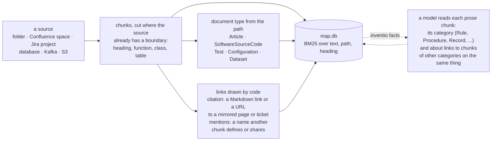
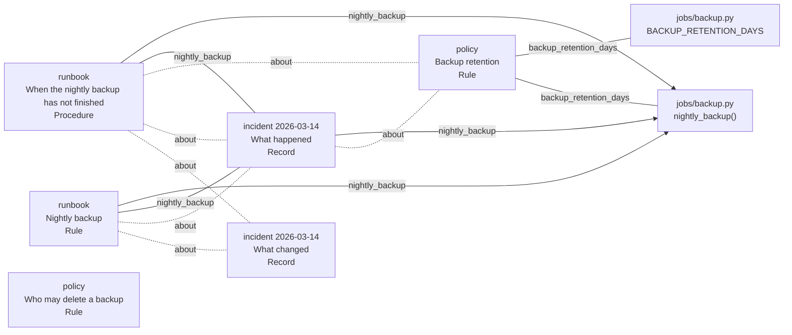
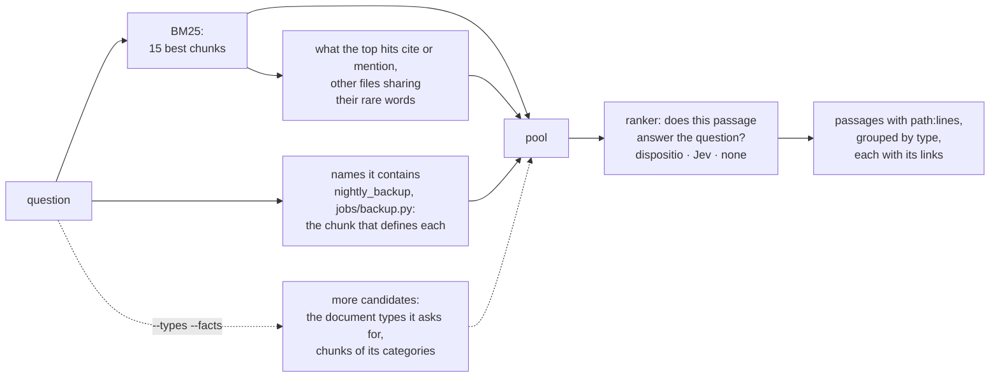

# How it works

It uses no embeddings. The structure comes from the sources themselves (headings, functions,
tables, the names files share), BM25 finds candidates, and a small decision model reorders them:
[dispositio](https://huggingface.co/minhquan2310/dispositio) on your own machine, or
[TypeSafe Jev](https://docs.typesafe.ai) in the cloud for sources you mark public. Everything
lives in one SQLite file.

## Ingest

Everything on a solid arrow is decided by code from what the source says; the dotted step is
the only one a model takes, only when asked, and it adds labels and links without changing a
chunk. A re-run reads only the files that changed: astropy (22,327 chunks) indexes in 12.8 s,
and again after one edit in 1.4 s. On `examples/webshop` the map is this graph:

Solid lines are names, found by code: the page that defines a name, and pages in different files
that name the same defined thing. Dotted lines are the `about` links Jev judged true, 6 of
the 10 pairs it was asked about; "Who may delete a backup" is linked to nothing, since it is
about a different act. The categories are Jev's too; it calls the runbook's opening section a
Rule, with p=0.38.

## Query

The pool only grows and the ranker only orders it: a passage that neither BM25 nor the names
brought in cannot come out. Looking up names needs no model and is on by default
(`--no-symbols` turns it off); on whole SWE-bench repositories it puts a file to fix among the
candidates for 73% of issues instead of 63%. With a ranker, the chunks the five best hits link to
join too (`--no-links` turns it off), up to ten; `--neighbours` also adds chunks of other files
sharing those hits' rarest words. The ranker reads up to 7 of what the names and links add, in one
more pass beside BM25's best 8. On SWE-bench Lite the names are the gain, links add little and
neighbours nothing, at 0.5 s a query (see [Limitations](https://github.com/minhquan23102000/inventio/blob/main/README.md#limitations)); on four public sets with
almost no links that pass does no better than giving the same seats to BM25's next 7. On a real
wiki, tracker and repository it is not yet measured. Without a ranker they are skipped, since
they would only sit below BM25's order. The two dotted options are off by default;
[benchmarks/README.md](../benchmarks/README.md) measures what each adds. A Vietnamese question is
also searched as pairs of adjacent syllables, since *hợp đồng* (contract) is two words to BM25.
